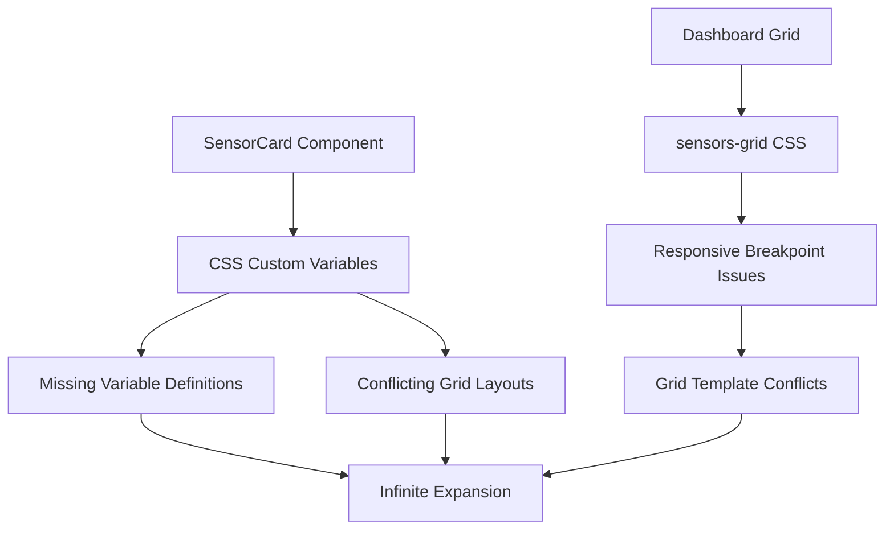
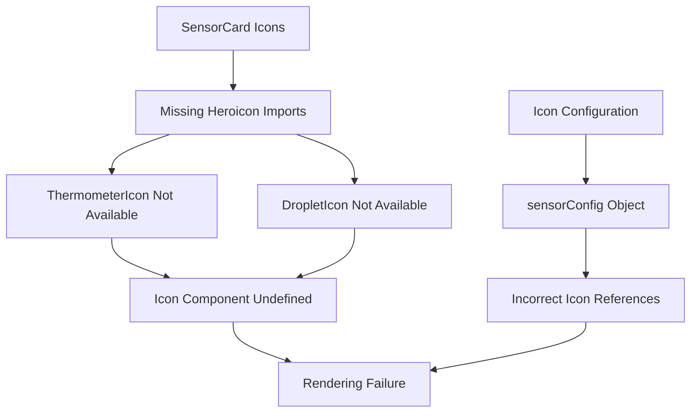
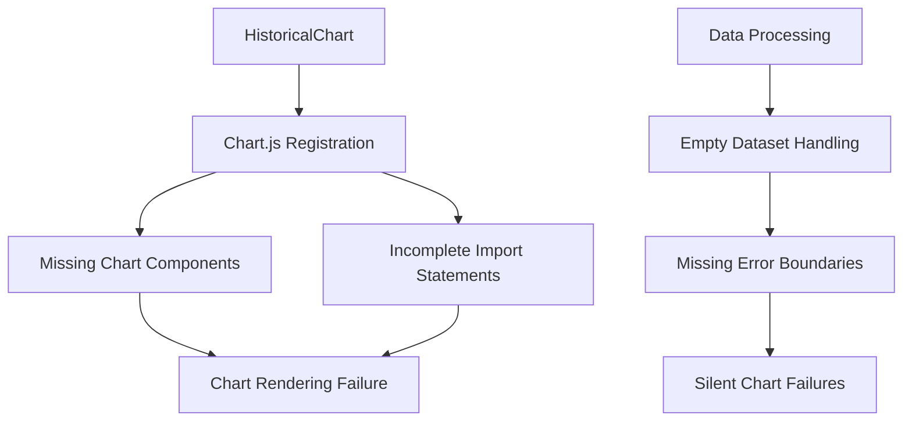
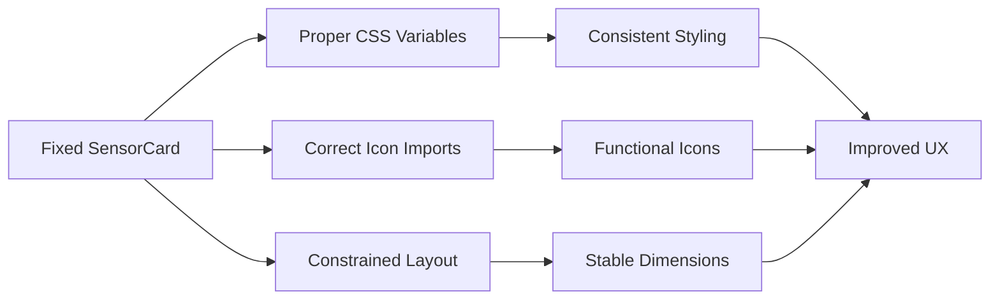
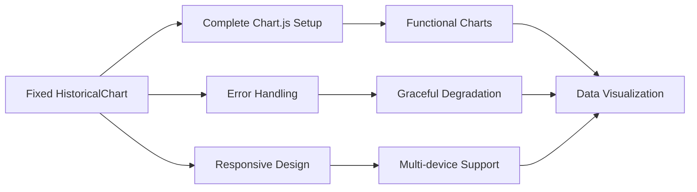
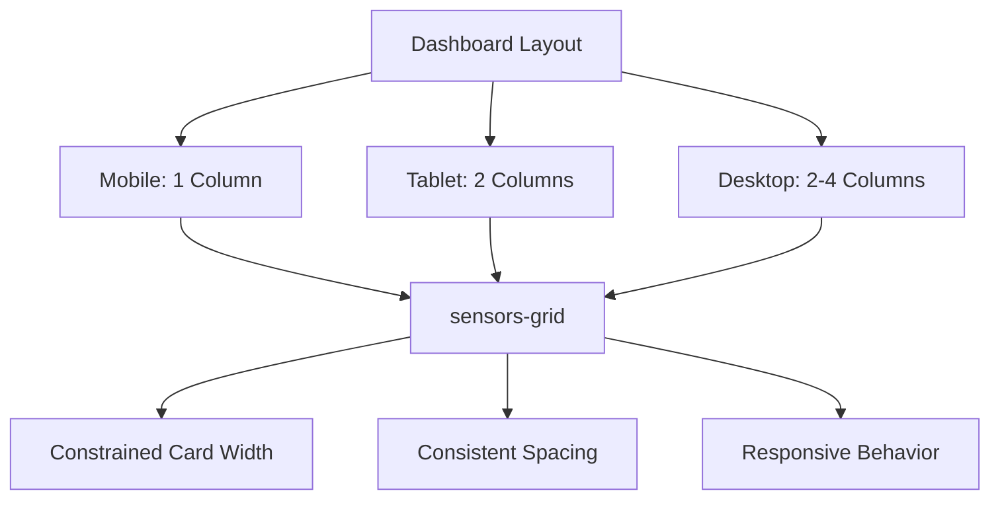
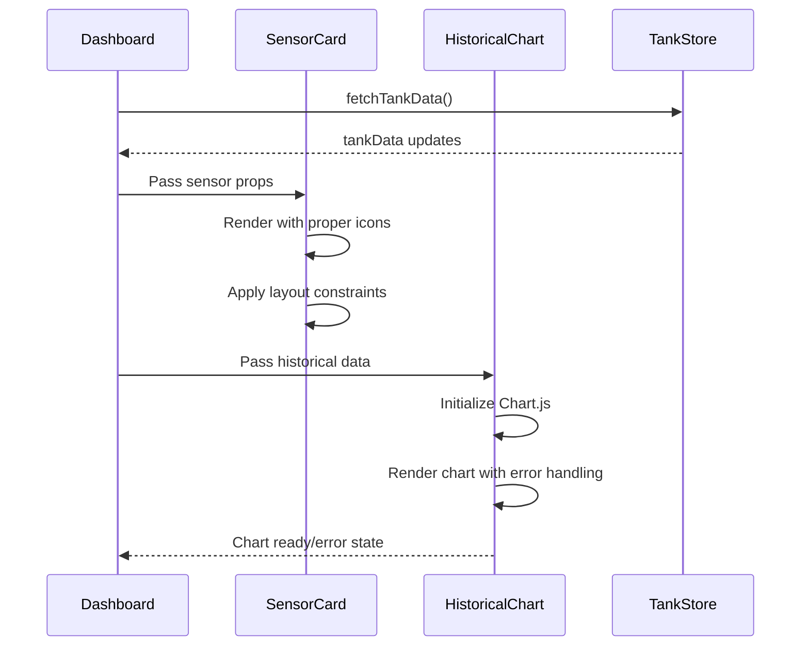

# Card Component Fix Design Document

## Overview

This design document addresses critical issues in the smartfish Vue.js application where sensor cards are exhibiting infinite expansion behavior, icons are not rendering correctly, and charts are non-functional. The problems stem from CSS custom property conflicts, missing icon imports, incomplete chart.js integration, and responsive layout issues.

## Technology Stack Context

- **Frontend Framework**: Vue 3 with Composition API
- **Build Tool**: Vite 7.0.6
- **Styling**: Tailwind CSS v3 + Custom CSS Variables
- **Icons**: Heroicons for Vue
- **Charts**: Chart.js 4.5.0 + vue-chartjs 5.3.2
- **State Management**: Pinia

## Problem Analysis

### 1. Card Expansion Issue

**Root Cause**: CSS variable conflicts and responsive grid layout problems



**Issues Identified**:

- Custom CSS variables (`--surface-primary`, `--radius-xl`, etc.) used but not consistently defined
- Grid layout conflicts between Tailwind utilities and custom CSS
- Missing container constraints causing cards to expand beyond intended bounds
- Float animation causing layout shifts

### 2. Icon Rendering Issue

**Root Cause**: Missing icon imports and configuration errors



**Issues Identified**:

- `ThermometerIcon` and `DropletIcon` not imported from Heroicons
- Fallback to `BeakerIcon` for multiple sensor types causing visual confusion
- Icon component references pointing to undefined imports

### 3. Chart Functionality Issue

**Root Cause**: Incomplete Chart.js integration and missing dependencies



**Issues Identified**:

- Incomplete Chart.js component registration
- Missing date adapter for time-based charts
- Canvas element not properly initialized
- Data transformation errors causing silent failures

## Solution Architecture

### Component Layer Fixes

#### SensorCard Component Improvements



**Key Changes**:

1. **CSS Variable Standardization**: Replace custom CSS variables with Tailwind utilities
2. **Icon Import Fixes**: Import correct Heroicons and provide proper fallbacks
3. **Layout Constraints**: Add explicit width/height constraints to prevent expansion
4. **Animation Optimization**: Improve CSS animations to prevent layout shifts

#### Chart Component Restoration



**Key Changes**:

1. **Chart.js Integration**: Complete setup with all required components
2. **Error Boundaries**: Add proper error handling for chart failures
3. **Data Validation**: Ensure robust data processing
4. **Responsive Configuration**: Optimize charts for different screen sizes

### Layout System Improvements

#### Grid Layout Optimization



**Responsive Strategy**:

- Mobile (< 640px): Single column layout
- Tablet (640px - 1024px): Two column layout
- Desktop (1024px - 1280px): Two column layout
- Large Desktop (> 1280px): Four column layout

### Component Implementation Details

#### 1. SensorCard Fix Implementation

**CSS Variable Replacement**:

```css
/* Replace custom variables with Tailwind utilities */
.sensor-card {
  @apply bg-white rounded-xl shadow-lg border border-teal-100 p-6;
  /* Remove: background: var(--surface-primary); */
  /* Remove: border-radius: var(--radius-xl); */
}
```

**Icon Import Corrections**:

```javascript
// Add missing icon imports
import {
  BeakerIcon,
  CloudIcon,
  ChevronUpIcon,
  ChevronDownIcon,
  MinusIcon,
  // Add these missing icons
  FireIcon,
  DropletIcon,
} from '@heroicons/vue/24/outline'
```

**Layout Constraints**:

```css
.sensor-card {
  /* Add explicit constraints */
  min-height: 280px;
  max-height: 320px;
  width: 100%;
  max-width: 400px;
}
```

#### 2. Chart Component Fix Implementation

**Complete Chart.js Setup**:

```javascript
import {
  Chart,
  LineController,
  LineElement,
  PointElement,
  LinearScale,
  CategoryScale,
  Title,
  Tooltip,
  Legend,
  TimeScale, // Add for time-based charts
} from 'chart.js'
import 'chartjs-adapter-date-fns' // Add date adapter
```

**Error Handling**:

```javascript
function initChart() {
  try {
    if (!chartCanvas.value) {
      console.warn('Chart canvas not available')
      return
    }
    // Chart initialization logic
  } catch (error) {
    console.error('Chart initialization failed:', error)
    // Show fallback UI
  }
}
```

#### 3. Dashboard Grid Fix Implementation

**Responsive Grid System**:

```css
.sensors-grid {
  display: grid;
  gap: 1rem;
  grid-template-columns: 1fr;
  grid-auto-rows: minmax(280px, max-content);
}

@media (min-width: 640px) {
  .sensors-grid {
    grid-template-columns: repeat(2, 1fr);
    gap: 1.5rem;
  }
}

@media (min-width: 1280px) {
  .sensors-grid {
    grid-template-columns: repeat(4, 1fr);
  }
}
```

## Data Flow Architecture

### Fixed Component Interaction



### State Management Considerations

**Store Integration**:

- Maintain existing Pinia store structure
- Add error state tracking for components
- Implement loading states for better UX

**Error Recovery**:

- Component-level error boundaries
- Graceful degradation for missing data
- Retry mechanisms for failed chart rendering

## Testing Strategy

### Component Testing

**SensorCard Tests**:

- Icon rendering with all sensor types
- Layout constraints under different data
- Responsive behavior across breakpoints
- Animation performance

**Chart Tests**:

- Chart initialization with valid data
- Error handling with invalid data
- Responsive chart resizing
- Time range selection functionality

**Integration Tests**:

- Dashboard layout with multiple cards
- Data flow from store to components
- Real-time updates without layout shifts

### Performance Considerations

**Optimization Targets**:

- Prevent layout thrashing from animations
- Minimize chart re-renders
- Optimize CSS for 60fps animations
- Reduce bundle size through proper imports

## Accessibility Compliance

### WCAG AA Standards

**Visual Requirements**:

- Maintain contrast ratios > 4.5:1
- Support for reduced motion preferences
- High contrast mode compatibility

**Interaction Requirements**:

- Keyboard navigation support
- Screen reader compatibility
- Focus management

## Browser Compatibility

**Target Support**:

- Chrome 90+
- Firefox 88+
- Safari 14+
- Edge 90+

**Fallback Strategies**:

- CSS Grid fallbacks for older browsers
- Chart.js polyfills for missing features
- Icon fallbacks for SVG rendering issues
