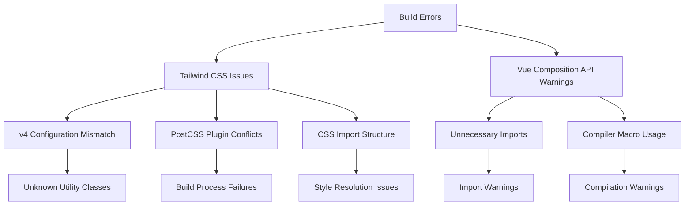
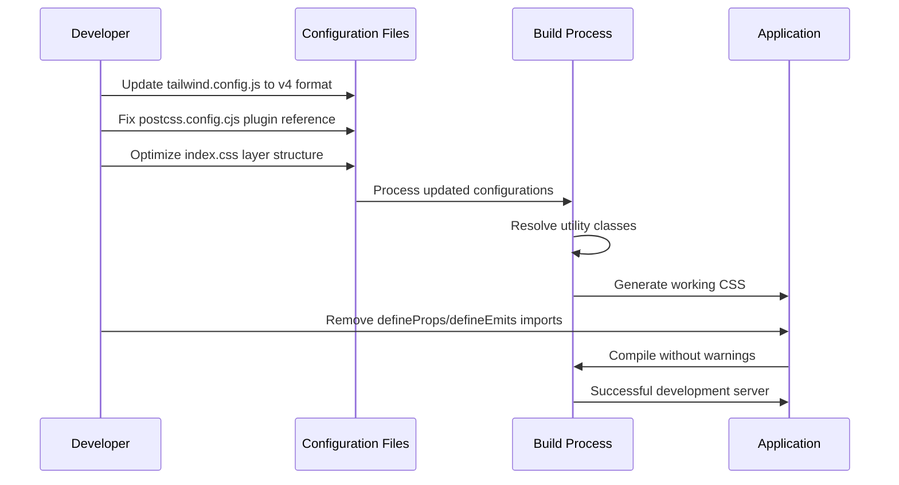

# SmartFish Error Fix Design

## Overview

This document addresses critical errors in the SmartFish Vue.js application related to Tailwind CSS v4 compatibility issues and Vue 3 Composition API warnings. The errors prevent proper compilation and development server functionality.

**Repository Type**: Frontend Application (Vue.js SPA)

## Problem Analysis

### 1. Tailwind CSS v4 Compatibility Issues

**Primary Error**: `Cannot apply unknown utility class 'md:p-6', 'bg-white'`

**Root Cause**: The project uses Tailwind CSS v4.1.11 with a configuration setup designed for v3.x, causing utility class resolution failures.

**Error Pattern**:

```
Error: Cannot apply unknown utility class `md:p-6`. Are you using CSS modules or similar and missing `@reference`?
Error: Cannot apply unknown utility class `bg-white`. Are you using CSS modules or similar and missing `@reference`?
```

### 2. Vue 3 Composition API Warnings

**Warning**: `defineProps` and `defineEmits` compiler macro import warnings

**Root Cause**: Vue 3.3+ treats `defineProps` and `defineEmits` as compiler macros that no longer require explicit imports.

## Error Classification



## Architecture Impact

### Current Configuration Issues

| Component            | Issue                      | Impact                           |
| -------------------- | -------------------------- | -------------------------------- |
| `tailwind.config.js` | v3 format with v4 package  | Utility class resolution failure |
| `postcss.config.cjs` | Incorrect plugin reference | CSS processing errors            |
| `src/index.css`      | Layer conflicts with v4    | Style compilation issues         |
| Vue Components       | Explicit macro imports     | Compiler warnings                |

### Affected Components

- `AlertsPanel.vue` - defineProps/defineEmits imports
- `HistoricalChart.vue` - defineEmits import
- `SensorCard.vue` - defineProps import
- `TankOverview.vue` - defineProps/defineEmits imports

## Solution Design

### Phase 1: Tailwind CSS Configuration Fix

#### 1.1 Update Tailwind Configuration

**Target**: `tailwind.config.js`

**Changes Required**:

- Convert to Tailwind CSS v4 syntax
- Add proper content scanning
- Configure theme extensions for v4

**New Configuration Structure**:

```javascript
import { type Config } from 'tailwindcss'

export default {
  content: [
    "./index.html",
    "./src/**/*.{vue,js,ts,jsx,tsx}"
  ],
  theme: {
    extend: {
      fontFamily: {
        sans: ['Inter', 'sans-serif'],
        mono: ['JetBrains Mono', 'monospace']
      }
    }
  }
} satisfies Config
```

#### 1.2 PostCSS Configuration Update

**Target**: `postcss.config.cjs`

**Issue**: Using `@tailwindcss/postcss` plugin incorrectly for v4

**Solution**: Use standard `tailwindcss` plugin reference

#### 1.3 CSS Structure Optimization

**Target**: `src/index.css`

**Changes**:

- Remove conflicting @layer directives for v4 compatibility
- Maintain custom CSS variables and component styles
- Ensure proper Tailwind directive placement

### Phase 2: Vue Composition API Cleanup

#### 2.1 Remove Unnecessary Imports

**Affected Files**:

- `src/components/AlertsPanel.vue`
- `src/components/SensorCard.vue`
- `src/components/TankOverview.vue`
- `src/components/HistoricalChart.vue`

**Action**: Remove `defineProps` and `defineEmits` from import statements

#### 2.2 Maintain Functionality

**Requirements**:

- Preserve all component prop definitions
- Maintain emit declarations
- Ensure type safety is retained

## Implementation Strategy

### Configuration Migration Flow



### File Modification Sequence

1. **tailwind.config.js** - Primary configuration fix
2. **postcss.config.cjs** - Plugin reference correction
3. **src/index.css** - Layer directive optimization
4. **Vue Components** - Import cleanup (batch operation)

### Testing Approach

#### 2.1 Configuration Validation

**Method**: Progressive testing approach

- Test configuration changes individually
- Verify utility class resolution
- Confirm CSS compilation success

#### 2.2 Component Functionality Testing

**Verification Points**:

- Component prop passing works correctly
- Event emission functions properly
- No runtime errors introduced
- Development server starts successfully

#### 2.3 Build Process Validation

**Test Cases**:

```bash
# Development server test
npm run dev

# Production build test
npm run build

# Code formatting test
npm run format
```

## Risk Assessment

### Low Risk Changes

- Vue component import cleanup (compiler handles macros automatically)
- PostCSS plugin reference update (standard configuration)

### Medium Risk Changes

- Tailwind configuration migration (requires testing of all utility classes)
- CSS layer structure modification (potential style conflicts)

### Mitigation Strategies

1. **Incremental Testing**: Apply changes one file at a time
2. **Backup Strategy**: Git commit before changes for easy rollback
3. **Validation Process**: Test all major UI components after each change
4. **Dependency Check**: Verify all Tailwind utility classes work in components

## Expected Outcomes

### Immediate Benefits

- ✅ Development server starts without errors
- ✅ Tailwind utility classes resolve correctly
- ✅ Build process completes successfully
- ✅ No compiler warnings in console

### Long-term Improvements

- 🔄 Future-proof Tailwind CSS v4 setup
- 🔄 Cleaner Vue 3 component code
- 🔄 Improved development experience
- 🔄 Better build performance

## Verification Checklist

### Configuration Fixes

- [ ] `tailwind.config.js` updated to v4 format
- [ ] `postcss.config.cjs` uses correct plugin reference
- [ ] `src/index.css` optimized for v4 compatibility
- [ ] All utility classes resolve in browser

### Component Updates

- [ ] `defineProps` imports removed from all components
- [ ] `defineEmits` imports removed from all components
- [ ] Component functionality preserved
- [ ] No runtime errors in browser console

### Build Validation

- [ ] `npm run dev` starts successfully
- [ ] `npm run build` completes without errors
- [ ] All pages load correctly in browser
- [ ] Styling appears as expected

## Dependencies & Prerequisites

### Required Knowledge

- Tailwind CSS v4 migration patterns
- Vue 3 Composition API best practices
- PostCSS configuration management

### Tools Required

- Node.js 20.19.0+ (project requirement)
- npm package manager
- Text editor with Vue.js support

### Backup Requirements

- Git repository state preserved
- Ability to rollback changes if needed
- Development environment snapshot
