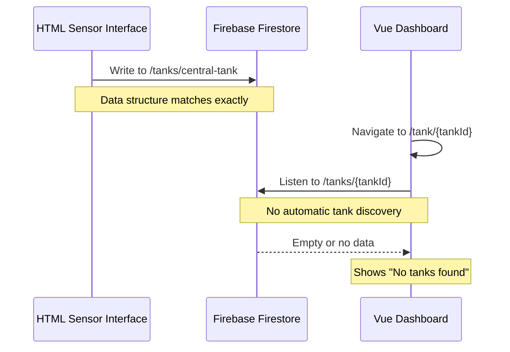

# Firebase Integration Fix for Tank Data Synchronization

## Overview

The current SmartFish application has a critical Firebase integration issue where the Vue.js dashboard cannot display tanks even though the HTML sensor collection interface successfully uploads data to Firestore. The root cause is a mismatch between how data is written to Firestore and how the Vue application expects to discover and read tank data.

## Problem Analysis

### Current Data Flow Issues



### Key Issues Identified

1. **Tank Discovery Gap**: Vue app requires explicit tank IDs via routes (`/tank/:tankId`) but has no mechanism to automatically discover available tanks from Firestore
2. **Navigation Mismatch**: HomeView expects a list of tanks but tankStore doesn't provide tank enumeration
3. **Route Dependency**: DashboardView expects `route.params.tankId` but users don't know which tank IDs exist
4. **Missing Tank Collection**: The Vue app uses `tankCollection` Map but never populates it with actual Firestore tanks

## Architecture Solution

### Enhanced Tank Discovery System

```mermaid
graph TB
    subgraph "Data Sources"
        HTML[HTML Sensor Interface]
        External[External Systems]
    end

    subgraph "Firebase Firestore"
        TankList[/tanks/ Collection]
        TankDoc[/tanks/{id} Document]
        History[/tanks/{id}/history Subcollection]
    end

    subgraph "Vue Application"
        HomeView[HomeView - Tank List]
        TankStore[Enhanced TankStore]
        DashboardView[DashboardView - Tank Details]
    end

    HTML --> TankDoc
    External --> TankDoc
    TankDoc --> History

    TankStore --> TankList
    TankList --> HomeView
    HomeView --> DashboardView
    TankStore --> TankDoc
```

### Data Structure Standardization

#### Firestore Document Structure

```typescript
// /tanks/{tankId}
interface TankDocument {
  name: string; // "Central Tank"
  location: string; // "Laboratory"
  stage: string; // "Growth"
  lastUpdate: string; // ISO timestamp
  sensors: {
    temperature: number; // 25.5
    ph: number; // 7.2
    oxygen: number; // 8.1
    salinity: number; // 30.0
  };
  // Note: status calculated by Vue app, not stored
}

// /tanks/{tankId}/history/{docId}
interface HistoryDocument {
  temperature: number;
  ph: number;
  oxygen: number;
  salinity: number;
  timestamp: Timestamp;
}
```

## Enhanced TankStore Implementation

### Tank Collection Management

```typescript
// Enhanced state management
const tankCollection = ref(new Map());
const availableTankIds = ref([]);
const selectedTankId = ref(null);

// Tank discovery methods
const discoverTanks = async () => {
  const tanksQuery = query(collection(db, 'tanks'));
  const snapshot = await getDocs(tanksQuery);

  const discoveredTanks = [];
  snapshot.forEach(doc => {
    if (doc.exists()) {
      const tankData = normalizeTankData(doc.data(), doc.id);
      tankCollection.value.set(doc.id, tankData);
      discoveredTanks.push(doc.id);
    }
  });

  availableTankIds.value = discoveredTanks;
  return discoveredTanks;
};

// Real-time tank list monitoring
const setupTankCollectionListener = () => {
  const tanksQuery = query(collection(db, 'tanks'));

  return onSnapshot(tanksQuery, snapshot => {
    const currentTanks = new Set();

    snapshot.docChanges().forEach(change => {
      const tankId = change.doc.id;
      currentTanks.add(tankId);

      if (change.type === 'added' || change.type === 'modified') {
        const tankData = normalizeTankData(change.doc.data(), tankId);
        tankCollection.value.set(tankId, tankData);
      }

      if (change.type === 'removed') {
        tankCollection.value.delete(tankId);
      }
    });

    availableTankIds.value = Array.from(currentTanks);
  });
};
```

### Auto-Navigation Logic

```typescript
// Smart tank selection for HomeView
const getDefaultTankForDashboard = () => {
  const tanks = Array.from(tankCollection.value.keys());

  // Priority order: central-tank, first alphabetical, any tank
  if (tanks.includes('central-tank')) return 'central-tank';
  if (tanks.length > 0) return tanks.sort()[0];
  return null;
};

// Enhanced navigation helpers
const navigateToFirstAvailableTank = router => {
  const defaultTank = getDefaultTankForDashboard();
  if (defaultTank) {
    router.push(`/tank/${defaultTank}`);
  } else {
    // No tanks found - show empty state
    router.push('/');
  }
};
```

## HomeView Enhancement

### Tank Grid Population

```vue
<!-- HomeView.vue template enhancement -->
<template>
  <div
    class="min-h-screen bg-gradient-to-br from-water-50 via-water-100 to-teal-50"
  >
    <!-- Existing header -->

    <!-- Tank Discovery Status -->
    <div v-if="isDiscovering" class="text-center py-8">
      <div
        class="animate-spin w-8 h-8 border-4 border-primary-teal border-t-transparent rounded-full mx-auto"
      ></div>
      <p class="text-gray-600 mt-4">Descobrindo tanques disponíveis...</p>
    </div>

    <!-- No Tanks Found State -->
    <div v-else-if="availableTanks.length === 0" class="text-center py-12">
      <div
        class="bg-blue-50 border border-blue-200 rounded-lg p-8 max-w-md mx-auto"
      >
        <h3 class="text-lg font-semibold text-blue-800 mb-2">
          Nenhum Tanque Encontrado
        </h3>
        <p class="text-blue-600 mb-4">
          Use a interface de coleta de dados para adicionar leituras de
          sensores, ou verifique se os dados estão sendo salvos corretamente no
          Firestore.
        </p>
        <button
          @click="retryDiscovery"
          class="px-4 py-2 bg-blue-600 text-white rounded-lg hover:bg-blue-700 transition-colors"
        >
          Tentar Novamente
        </button>
      </div>
    </div>

    <!-- Tank Grid with discovered tanks -->
    <TankGrid
      v-else
      :tanks="availableTanks"
      :loading="isLoading"
      @tank-selected="navigateToTank"
    />
  </div>
</template>
```

```typescript
// HomeView.vue script enhancement
export default {
  setup() {
    const tankStore = useTankStore();
    const router = useRouter();

    const isDiscovering = ref(true);
    const availableTanks = computed(() => tankStore.tankSummaries);

    const navigateToTank = tankId => {
      router.push(`/tank/${tankId}`);
    };

    const retryDiscovery = async () => {
      isDiscovering.value = true;
      await tankStore.discoverTanks();
      isDiscovering.value = false;
    };

    onMounted(async () => {
      try {
        // Discover available tanks
        await tankStore.discoverTanks();

        // Setup real-time tank collection monitoring
        tankStore.setupTankCollectionListener();

        // Auto-navigate to dashboard if user prefers (optional)
        const shouldAutoNavigate =
          localStorage.getItem('autoNavigateToTank') === 'true';
        if (shouldAutoNavigate && availableTanks.value.length > 0) {
          navigateToTank(availableTanks.value[0].id);
        }
      } catch (error) {
        console.error('Error discovering tanks:', error);
      } finally {
        isDiscovering.value = false;
      }
    });

    return {
      isDiscovering,
      availableTanks,
      navigateToTank,
      retryDiscovery,
    };
  },
};
```

## DashboardView Route Fallback

### Enhanced Route Handling

```typescript
// DashboardView.vue lifecycle enhancement
onMounted(async () => {
  try {
    const tankId = route.params.tankId;

    if (!tankId) {
      console.warn('No tank ID provided, discovering tanks...');
      await tankStore.discoverTanks();
      const defaultTank = tankStore.getDefaultTankForDashboard();

      if (defaultTank) {
        router.replace(`/tank/${defaultTank}`);
        return;
      } else {
        router.push('/');
        return;
      }
    }

    // Ensure tank exists before setting up listener
    await tankStore.discoverTanks();

    if (!tankStore.tankCollection.has(tankId)) {
      console.warn(`Tank ${tankId} not found, redirecting...`);
      const defaultTank = tankStore.getDefaultTankForDashboard();
      if (defaultTank) {
        router.replace(`/tank/${defaultTank}`);
      } else {
        router.push('/');
      }
      return;
    }

    // Proceed with normal tank selection
    tankStore.selectTank(tankId);
  } catch (error) {
    console.error('Error initializing dashboard:', error);
    router.push('/');
  }
});
```

## Data Synchronization Validation

### Real-time Sync Verification

```typescript
// Enhanced data validation in tankStore
const validateDataSync = (tankId, receivedData) => {
  const requiredFields = ['name', 'location', 'stage', 'lastUpdate', 'sensors'];
  const requiredSensors = ['temperature', 'ph', 'oxygen', 'salinity'];

  // Validate main structure
  for (const field of requiredFields) {
    if (!receivedData.hasOwnProperty(field)) {
      console.warn(`Missing required field: ${field} for tank ${tankId}`);
      return false;
    }
  }

  // Validate sensor data
  if (!receivedData.sensors || typeof receivedData.sensors !== 'object') {
    console.warn(`Invalid sensors data for tank ${tankId}`);
    return false;
  }

  for (const sensor of requiredSensors) {
    if (typeof receivedData.sensors[sensor] !== 'number') {
      console.warn(`Invalid sensor value for ${sensor} in tank ${tankId}`);
      return false;
    }
  }

  return true;
};
```

## Testing Strategy

### Integration Test Cases

1. **Tank Discovery Test**
   - Verify `discoverTanks()` finds existing tanks
   - Test real-time tank addition/removal
   - Validate tank data normalization

2. **Route Navigation Test**
   - Test `/tank/:tankId` with valid tank ID
   - Test navigation with invalid tank ID
   - Test auto-fallback to default tank

3. **Data Synchronization Test**
   - Verify HTML → Firestore → Vue data flow
   - Test real-time updates
   - Validate data structure consistency

4. **Error Handling Test**
   - Test no tanks found scenario
   - Test Firestore connection errors
   - Test invalid data format handling

### Development Verification Commands

```bash
# 1. Open browser console on HTML interface
# 2. Execute test data upload
window.testSync()

# 3. Check Firestore in Firebase Console
# 4. Navigate to Vue app home page
# 5. Verify tank discovery and navigation
```

## Implementation Priority

### Phase 1: Core Tank Discovery (High Priority)

- [ ] Implement `discoverTanks()` in tankStore
- [ ] Add tank collection real-time listener
- [ ] Update HomeView tank grid population
- [ ] Test with existing `central-tank` data

### Phase 2: Enhanced Navigation (Medium Priority)

- [ ] Implement smart tank selection
- [ ] Add route fallback logic in DashboardView
- [ ] Add "no tanks found" empty state
- [ ] Implement retry mechanism

### Phase 3: Data Validation (Low Priority)

- [ ] Add data structure validation
- [ ] Implement sync verification
- [ ] Add comprehensive error handling
- [ ] Add integration tests

This design addresses the core issue of tank discovery while maintaining backward compatibility with existing data structures and ensuring robust error handling for edge cases.
