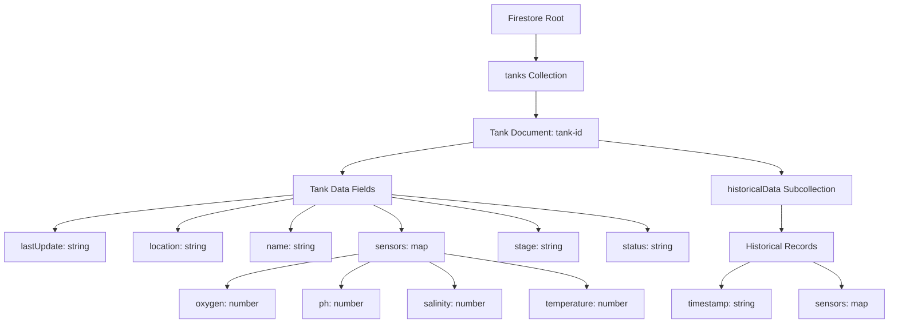
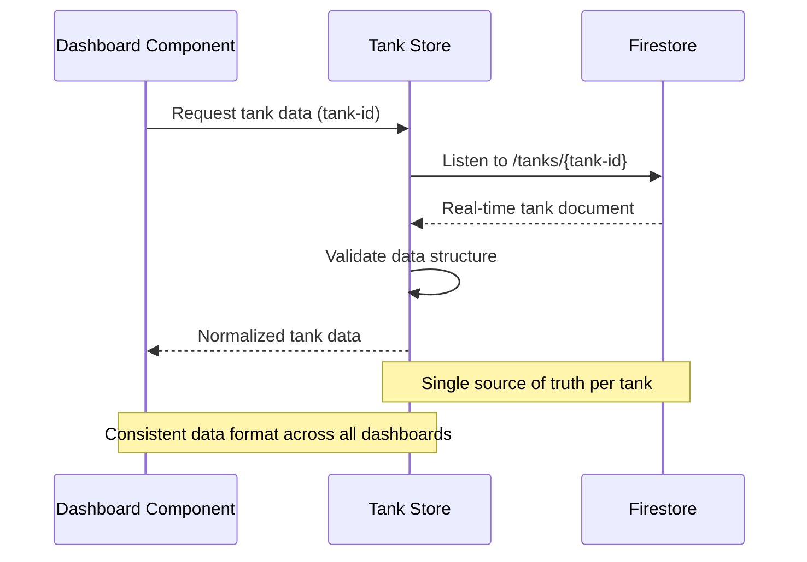

# Firestore Path Normalization Design

## Overview

This design addresses the inconsistent Firestore path usage across dashboards in the SmartFish monitoring system. Currently, different dashboard components access tank data through various path structures, leading to data inconsistencies and confusion. The solution standardizes all data access to use `/tanks/{tank-id}` paths and normalizes the data format to match how sensors actually save data.

## Current Problem Analysis

### Path Inconsistencies

- Some components access `/tanks/tanque-central/historicalData/`
- Others use hardcoded `central-tank` references
- Dashboard data shows different values due to accessing different document structures
- Historical data is mixed with real-time dashboard data

### Data Structure Misalignment

Current Firestore structure varies between:

```
// Nested structure (inconsistent)
/tanks/central-tank/tankData/sensors/...

// Mixed historical structure
/tanks/tanque-central/historicalData/...
```

Expected sensor data format (as saved by sensors):

```json
{
  "lastUpdate": "2025-08-28T18:26:08.499Z",
  "location": "Laboratório",
  "name": "Tanque Sul",
  "sensors": {
    "oxygen": 8.3,
    "ph": 7.2,
    "salinity": 32,
    "temperature": 24.5
  },
  "stage": "Monitoramento",
  "status": "healthy"
}
```

## Architecture

### Standardized Path Structure



### Data Access Pattern Normalization



## Data Models & Schema

### Tank Document Schema

```typescript
interface TankDocument {
  lastUpdate: string; // ISO 8601 timestamp
  location: string; // Physical location
  name: string; // Display name
  sensors: SensorReadings; // Current sensor values
  stage: string; // Tank lifecycle stage
  status: string; // Computed or explicit status
}

interface SensorReadings {
  oxygen: number; // mg/L
  ph: number; // pH scale
  salinity: number; // ppt
  temperature: number; // Celsius
}
```

### Historical Data Subcollection Schema

```typescript
interface HistoricalRecord {
  timestamp: string; // ISO 8601 timestamp
  sensors: SensorReadings; // Sensor readings at timestamp
  exportedAt?: string; // Optional export timestamp
}
```

## Implementation Strategy

### Phase 1: Path Standardization

#### Tank Store Modifications

- Remove hardcoded path references
- Implement dynamic tank ID resolution
- Standardize Firestore document references

```typescript
// Before: Mixed path usage
const tankRef = doc(db, 'tanks', 'central-tank');
const historicalRef = doc(db, 'tanks', 'tanque-central', 'historicalData');

// After: Consistent path pattern
const getTankRef = (tankId: string) => doc(db, 'tanks', tankId);
const getHistoricalRef = (tankId: string) =>
  collection(db, 'tanks', tankId, 'historicalData');
```

#### Dashboard Component Updates

- Remove direct Firestore access from components
- Use tank store as single data source
- Implement tank ID parameter passing

### Phase 2: Data Structure Normalization

#### Real-time Data Handling

```typescript
interface DataNormalizationLayer {
  // Normalize incoming sensor data to expected format
  normalizeTankData(rawFirestoreData: any): TankDocument;

  // Validate data structure compliance
  validateDataStructure(data: TankDocument): boolean;

  // Handle legacy data format migration
  migrateLegacyData(legacyData: any): TankDocument;
}
```

#### Historical Data Separation

- Move historical data to dedicated subcollections
- Maintain real-time data in main tank document
- Implement query optimization for dashboard vs historical views

### Phase 3: Dashboard Integration

#### Component Data Binding

```mermaid
graph LR
    A[DashboardView] --> B[Tank Store]
    C[TankOverview] --> B
    D[SensorCard] --> B
    E[AlertsPanel] --> B

    B --> F[Normalized Tank Data]
    F --> G[/tanks/tank-id]
```

#### State Management Updates

- Centralize tank selection logic
- Implement reactive tank switching
- Maintain consistent data format across components

## Testing Strategy

### Data Consistency Validation

```typescript
describe('Firestore Path Normalization', () => {
  test('All dashboard components use same tank data source', () => {
    // Verify components access data through tank store
    // Validate consistent data format across components
  });

  test('Tank ID resolution works for all tank references', () => {
    // Test dynamic tank ID parameter handling
    // Verify correct Firestore path construction
  });

  test('Data structure matches sensor output format', () => {
    // Validate sensor data schema compliance
    // Test timestamp format consistency
  });
});
```

### Real-time Synchronization Testing

- Verify real-time updates work with new path structure
- Test data consistency during tank switching
- Validate historical data separation

## Migration Considerations

### Backward Compatibility

- Support legacy path access during transition
- Implement gradual migration strategy
- Maintain existing data while restructuring

### Data Migration Steps

1. **Document Structure Analysis**: Audit existing Firestore documents
2. **Path Mapping**: Create mapping between old and new paths
3. **Data Validation**: Ensure sensor data format compliance
4. **Component Updates**: Update all dashboard components incrementally
5. **Legacy Cleanup**: Remove deprecated path usage after validation

### Rollback Strategy

- Maintain dual path support during migration
- Implement feature flags for new path usage
- Prepare rollback procedures for critical issues

## Performance Considerations

### Query Optimization

- Use single document listeners per tank
- Implement efficient tank switching
- Optimize historical data queries with proper indexing

### Caching Strategy

- Cache tank metadata for faster switching
- Implement local state persistence
- Use computed properties for derived data

### Resource Management

- Proper cleanup of Firestore listeners
- Efficient memory usage for multiple tank data
- Optimized re-rendering patterns
