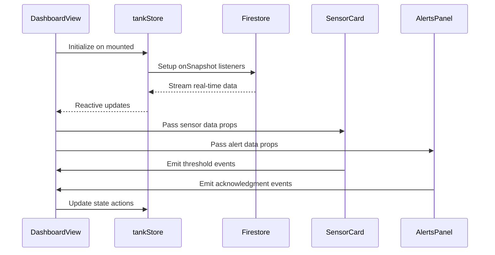

# Smartish Aquaculture Monitoring System Design

## Overview

Smartish is a modern, professional aquaculture monitoring application designed to provide real-time oversight of fish farming operations. The system monitors critical water quality parameters including temperature, pH, dissolved oxygen, and salinity across multiple fish tanks. Built with Vue 3 and Firebase Firestore, the application delivers a responsive, water-themed interface that enables aquaculture managers to maintain optimal conditions for fish health and growth.

### Core Value Proposition

- **Real-time monitoring** of critical water parameters with sub-second latency
- **Smart alert system** with configurable thresholds and priority levels
- **Historical data analysis** with interactive time-series visualization
- **Multi-tank management** supporting scalable aquaculture operations
- **Modern water-themed UI** with professional design and accessibility compliance

### Target Users

- Aquaculture farm managers and operators
- Fish farming technicians
- Aquaculture consultants and researchers
- Small to medium-scale fish farming operations

## Technology Stack & Dependencies

### Frontend Framework

- **Vue 3.5.18** with Composition API for reactive component architecture
- **Vite 7.0.6** for fast development and optimized production builds
- **Vue Router 4.5.1** for client-side navigation and route management
- **Pinia 3.0.3** for centralized state management

### UI & Styling

- **Tailwind CSS 3.4.17** for utility-first styling with water-themed color palette
- **PostCSS + Autoprefixer** for CSS processing and vendor prefixes
- **@heroicons/vue** for consistent iconography (BeakerIcon for sensor fallbacks)
- **Glass morphism effects** and water ripple animations for modern aesthetics

#### Tailwind CSS Configuration

Tailwind CSS v3.4.17 must be configured using CommonJS format in `tailwind.config.js`:

```javascript
// tailwind.config.js (CommonJS format required)
module.exports = {
  content: ["./index.html", "./src/**/*.{vue,js,ts,jsx,tsx}"],
  theme: {
    extend: {
      colors: {
        "primary-teal": "#0d9488",
        "light-teal": "#5eead4",
        "dark-teal": "#0f766e",
        "accent-teal": "#2dd4bf",
        "deep-teal": "#134e4a",
      },
    },
  },
  plugins: [],
};
```

#### PostCSS Configuration

```javascript
// postcss.config.js
module.exports = {
  plugins: {
    tailwindcss: {}, // Use standard 'tailwindcss' plugin, not v4 '@tailwindcss/postcss'
    autoprefixer: {},
  },
};
```

#### CSS Import Structure

```css
/* src/index.css - Use standard Tailwind v3 directive syntax */
@tailwind base;
@tailwind components;
@tailwind utilities;

/* Custom water-themed styles */
@layer components {
  .glass-morphism {
    @apply backdrop-blur-md bg-white/10 border border-white/20;
  }
}
```

### Data Visualization

- **Chart.js 4.5.0** for time-series data visualization
- **vue-chartjs 5.3.2** for Vue 3 Chart.js integration
- **chartjs-adapter-date-fns** for time-based chart support
- **date-fns** for date manipulation and formatting

### Backend & Database

- **Firebase 12.1.0** for cloud backend services
- **Firebase Firestore** for real-time database with NoSQL document storage
- **Firebase Analytics** for usage tracking and performance monitoring

### Development Tools

- **Prettier 3.6.2** for consistent code formatting
- **Node.js ^20.19.0 || >=22.12.0** runtime requirement
- **ESLint** for code quality and best practices

## Component Architecture

### Component Hierarchy

```mermaid
graph TB
    A[App.vue] --> B[DashboardView.vue]
    A --> C[SettingsView.vue]
    A --> D[HomeView.vue]

    B --> E[TankOverview.vue]
    B --> F[AlertsPanel.vue]
    B --> G[HistoricalChart.vue]

    E --> H[SensorCard.vue]
    E --> I[SensorCard.vue]
    E --> J[SensorCard.vue]
    E --> K[SensorCard.vue]

    F --> L[AlertItem.vue]

    style A fill:#0d9488
    style B fill:#5eead4
    style E fill:#2dd4bf
    style H fill:#134e4a
```



### Core Components

#### App.vue (Root Component)

- Initializes Vue application and routing
- Configures global styles and theme variables
- Manages navigation state and user session

#### DashboardView.vue (Main Dashboard)

- Primary monitoring interface aggregating all tank data
- Coordinates real-time updates across child components
- Handles user interactions and event delegation
- Manages layout responsiveness and mobile adaptation

#### TankOverview.vue (Tank Status Container)

- Displays comprehensive tank information and metadata
- Aggregates multiple SensorCard instances
- Shows tank status indicators (healthy, warning, critical)
- Provides tank-level controls and configuration access

#### SensorCard.vue (Individual Sensor Display)

- Reusable component for each sensor type (temperature, pH, oxygen, salinity)
- Real-time value display with status color coding
- Threshold visualization with warning indicators
- Trend arrows showing value changes over time
- Responsive design with mobile-first approach

**Props Interface:**

```javascript
defineProps({
  sensorType: String, // 'temperature', 'ph', 'oxygen', 'salinity'
  currentValue: Number, // Real-time sensor reading
  threshold: Object, // { min, max, critical }
  unit: String, // Display unit (°C, pH, mg/L, ppt)
  status: String, // 'normal', 'warning', 'critical'
  lastUpdate: Date, // Timestamp of last reading
});
```

#### AlertsPanel.vue (Alert Management)

- Displays prioritized alerts with severity levels
- Sound notification toggle and management
- Alert acknowledgment and dismissal functionality
- Critical alert highlighting with visual emphasis
- Historical alert log with filtering capabilities

#### HistoricalChart.vue (Data Visualization)

- Interactive time-series charts for trend analysis
- Multi-parameter overlay with color-coded datasets
- Configurable time ranges (1h, 6h, 24h, 7d, 30d)
- Zoom and pan functionality for detailed analysis
- Export capabilities for data analysis

### Component Communication Patterns



## State Management

### Pinia Store Architecture

#### tankStore.js (Primary State Store)

Centralized state management for all tank-related data using Pinia with Vue 3 reactivity.

**State Structure:**

```javascript
const tankStore = defineStore("tank", () => {
  // Reactive state
  const tankData = ref({
    lastUpdate: null,
    location: "Unknown",
    name: "Tank",
    sensors: {
      oxygen: 0,
      ph: 0,
      salinity: 0,
      temperature: 0,
    },
    stage: "Growth",
    status: "healthy",
  });

  const historicalData = ref([]);
  const alerts = ref([]);
  const thresholds = ref({});
  const connectionStatus = ref("connected");
  const isLoading = ref(false);

  // Computed getters
  const sensorStatuses = computed(() => {
    // Calculate status for each sensor based on thresholds
  });

  const criticalAlerts = computed(() => {
    return alerts.value.filter((alert) => alert.severity === "critical");
  });

  // Actions
  const fetchTankData = async () => {
    /* Firebase operations */
  };
  const updateThresholds = async (newThresholds) => {
    /* Update logic */
  };
  const acknowledgeAlert = async (alertId) => {
    /* Alert management */
  };

  return {
    tankData,
    historicalData,
    alerts,
    thresholds,
    connectionStatus,
    isLoading,
    sensorStatuses,
    criticalAlerts,
    fetchTankData,
    updateThresholds,
    acknowledgeAlert,
  };
});
```

### Real-time Data Synchronization

Firebase Firestore integration with `onSnapshot` listeners for real-time updates:

```javascript
// Real-time listener setup
const setupRealtimeListener = () => {
  const tankRef = doc(db, "tanks", tankId);

  return onSnapshot(
    tankRef,
    (docSnap) => {
      if (docSnap.exists()) {
        tankData.value = docSnap.data();
        checkAlerts(tankData.value.sensors);
      }
    },
    (error) => {
      console.error("Firestore listener error:", error);
      connectionStatus.value = "error";
    }
  );
};
```

## Routing & Navigation

### Route Configuration

```javascript
const routes = [
  {
    path: "/",
    name: "Home",
    component: HomeView,
    meta: { title: "Smartish - Home" },
  },
  {
    path: "/dashboard",
    name: "Dashboard",
    component: DashboardView,
    meta: { title: "Dashboard - Tank Monitoring", requiresAuth: false },
  },
  {
    path: "/settings",
    name: "Settings",
    component: SettingsView,
    meta: { title: "Settings - Tank Configuration" },
  },
];
```

### Navigation Component

Modern navigation with water-themed styling and responsive design:

- Logo with water drop iconography
- Active route highlighting with teal accent colors
- Mobile hamburger menu with smooth animations
- Breadcrumb navigation for deep-level pages

## Styling Strategy

### Water-Themed Design System

#### Color Palette

```css
:root {
  --primary-teal: #0d9488; /* Primary brand color */
  --light-teal: #5eead4; /* Light accents and highlights */
  --dark-teal: #0f766e; /* Dark text and borders */
  --accent-teal: #2dd4bf; /* Interactive elements */
  --deep-teal: #134e4a; /* Deep contrast elements */

  /* Semantic colors */
  --success: #10b981;
  --warning: #f59e0b;
  --error: #ef4444;
  --info: #3b82f6;
}
```

#### Design Elements

- **Glass Morphism**: Semi-transparent cards with backdrop blur effects
- **Water Ripple Animations**: Subtle CSS animations for interactive elements
- **Floating Effects**: Box shadows and transforms for depth perception
- **Gradient Overlays**: Smooth color transitions for visual hierarchy

#### Typography Scale

```css
.text-xs {
  font-size: 0.75rem;
} /* Small labels */
.text-sm {
  font-size: 0.875rem;
} /* Body text */
.text-base {
  font-size: 1rem;
} /* Default */
.text-lg {
  font-size: 1.125rem;
} /* Headings */
.text-xl {
  font-size: 1.25rem;
} /* Page titles */
.text-2xl {
  font-size: 1.5rem;
} /* Hero text */
```

### Responsive Design

Mobile-first approach with Tailwind CSS breakpoints:

- **sm**: 640px+ (small tablets)
- **md**: 768px+ (tablets)
- **lg**: 1024px+ (laptops)
- **xl**: 1280px+ (desktops)

### Accessibility Features

- **WCAG AA compliance** with 4.5:1 contrast ratios
- **Focus indicators** with visible outline styles
- **Screen reader support** with proper ARIA labels
- **Reduced motion** respect for prefers-reduced-motion
- **High contrast mode** compatibility

## API Integration Layer

### Firebase Configuration

Environment-based configuration with secure credential management:

```javascript
// firebaseConfig.js
const firebaseConfig = {
  apiKey: process.env.VITE_FIREBASE_API_KEY,
  authDomain: "smartfish-c4ac7.firebaseapp.com",
  projectId: "smartfish-c4ac7",
  storageBucket: "smartfish-c4ac7.firebasestorage.app",
  messagingSenderId: "260869781807",
  appId: "1:260869781807:web:ef105a272181166b7349da",
  measurementId: "G-R0CHPDN105",
};
```

### Data Models & Schema

#### Tank Data Model

```javascript
{
  "tankData": {
    "lastUpdate": "2025-08-14T19:14:08.771Z",
    "location": "Fish Farm - Section A",
    "name": "Central Tank",
    "sensors": {
      "oxygen": 8.2,        // mg/L - Dissolved oxygen
      "ph": 6.8,            // pH units
      "salinity": 30,       // ppt - Parts per thousand
      "temperature": 26.5   // °C - Celsius
    },
    "stage": "Growth",      // Lifecycle stage
    "status": "healthy"     // Overall tank status
  },
  "historicalData": [
    {
      "timestamp": "2025-08-14T19:00:00.000Z",
      "sensors": { /* sensor readings */ }
    }
  ],
  "thresholds": {
    "temperature": { "min": 20, "max": 30, "critical": 35 },
    "ph": { "min": 6.0, "max": 8.0, "critical": 9.0 },
    "oxygen": { "min": 5.0, "max": 12.0, "critical": 3.0 },
    "salinity": { "min": 25, "max": 35, "critical": 40 }
  }
}
```

#### Alert Data Model

```javascript
{
  "alerts": [
    {
      "id": "alert_001",
      "timestamp": "2025-08-14T19:14:08.771Z",
      "severity": "critical",    // 'info', 'warning', 'critical'
      "sensor": "oxygen",
      "currentValue": 3.2,
      "threshold": 5.0,
      "message": "Oxygen level critically low",
      "acknowledged": false,
      "tankId": "tank_central"
    }
  ]
}
```

### API Methods

#### Real-time Data Operations

```javascript
// Fetch current tank data
async function fetchTankData(tankId) {
  const tankRef = doc(db, "tanks", tankId);
  const snapshot = await getDoc(tankRef);
  return snapshot.exists() ? snapshot.data() : null;
}

// Update sensor thresholds
async function updateThresholds(tankId, thresholds) {
  const thresholdRef = doc(db, "thresholds", tankId);
  await setDoc(thresholdRef, thresholds, { merge: true });
}

// Acknowledge alert
async function acknowledgeAlert(alertId) {
  const alertRef = doc(db, "alerts", alertId);
  await updateDoc(alertRef, {
    acknowledged: true,
    acknowledgedAt: serverTimestamp(),
  });
}
```

#### Historical Data Queries

```javascript
// Get historical data for time range
async function getHistoricalData(tankId, timeRange) {
  const historyRef = collection(db, `tanks/${tankId}/history`);
  const startTime = new Date(Date.now() - timeRange);

  const q = query(
    historyRef,
    where("timestamp", ">=", startTime),
    orderBy("timestamp", "desc"),
    limit(1000)
  );

  const snapshot = await getDocs(q);
  return snapshot.docs.map((doc) => ({
    id: doc.id,
    ...doc.data(),
  }));
}
```

## Testing Strategy

### Unit Testing Framework

- **Vitest** for fast unit test execution with Vue 3 support
- **@vue/test-utils** for Vue component testing utilities
- **Testing Library** for user-centric testing approaches

### Component Testing Strategy

```javascript
// SensorCard.vue test example
describe("SensorCard", () => {
  test("displays sensor value correctly", () => {
    const wrapper = mount(SensorCard, {
      props: {
        sensorType: "temperature",
        currentValue: 26.5,
        unit: "°C",
        status: "normal",
      },
    });

    expect(wrapper.text()).toContain("26.5°C");
    expect(wrapper.classes()).toContain("status-normal");
  });

  test("shows warning state for threshold violations", () => {
    const wrapper = mount(SensorCard, {
      props: {
        currentValue: 35,
        threshold: { max: 30, critical: 35 },
        status: "warning",
      },
    });

    expect(wrapper.classes()).toContain("status-warning");
  });
});
```

### Integration Testing

- **Cypress** for end-to-end testing of user workflows
- **Firebase Test SDK** for database integration testing
- **Mock Service Worker** for API mocking during tests

### Test Coverage Requirements

- **Component Tests**: 90%+ coverage for all Vue components
- **Store Tests**: 100% coverage for Pinia store actions and getters
- **Integration Tests**: Critical user journeys and data flows
- **Accessibility Tests**: WCAG compliance verification
