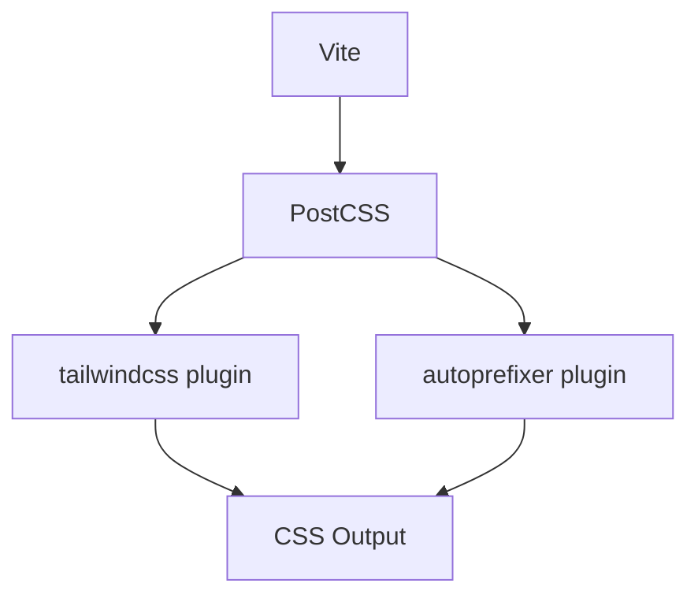
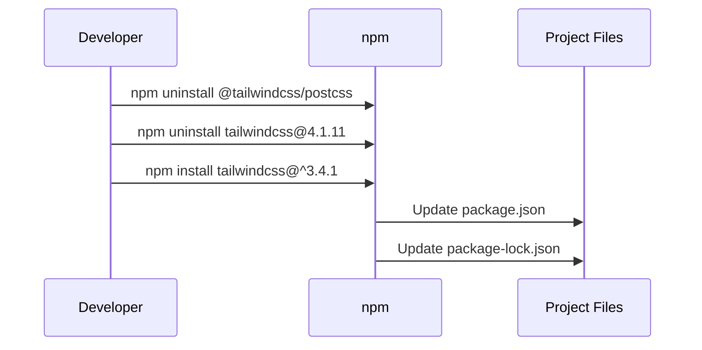
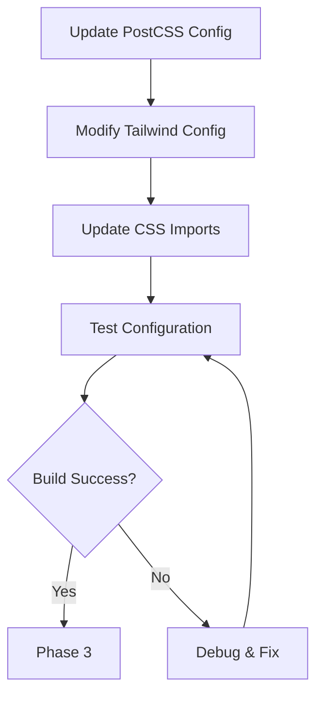
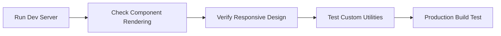
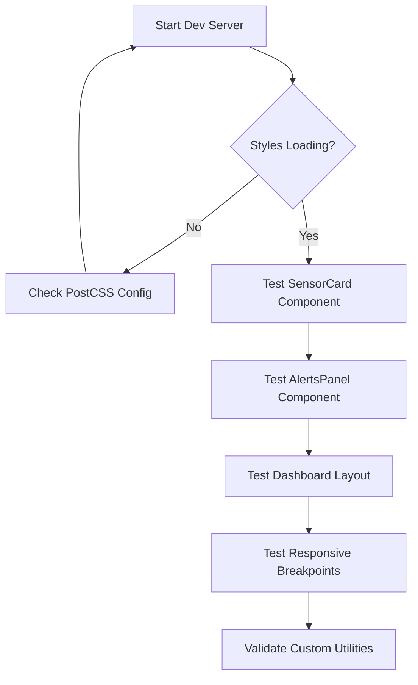

# Tailwind CSS v4 to v3 Downgrade Design

## Overview

The SmartFish project is currently experiencing styling issues due to incompatibility with Tailwind CSS v4. This design outlines the process to downgrade from Tailwind CSS v4.1.11 to v3.x to restore proper styling functionality while maintaining all existing UI components and design patterns.

### Current Issues
- Styles not applying correctly due to Tailwind v4 syntax changes
- New CSS import structure (`@import "tailwindcss/css"`) incompatible with current setup
- PostCSS configuration conflicts with Tailwind v4 architecture

### Target Outcome
- Fully functional styling system using Tailwind CSS v3.x
- Preserved component designs and responsive layouts
- Maintained custom CSS utilities and design system
- Compatible PostCSS configuration

## Technology Stack Impact

### Current Dependencies (Problematic)
```json
{
  "@tailwindcss/postcss": "^4.1.11",
  "tailwindcss": "^4.1.11",
  "postcss": "^8.5.6",
  "autoprefixer": "^10.4.21"
}
```

### Target Dependencies (Compatible)
```json
{
  "tailwindcss": "^3.4.1",
  "postcss": "^8.5.6",
  "autoprefixer": "^10.4.21"
}
```

## Configuration Changes Architecture

### 1. Package.json Dependencies Update

**Remove:**
- `@tailwindcss/postcss` (v4 specific package)
- `tailwindcss: ^4.1.11`

**Install:**
- `tailwindcss: ^3.4.1` (latest stable v3 release)

### 2. PostCSS Configuration Migration

**Current v4 Structure:**
```mermaid
graph TD
    A[Vite] --> B[@tailwindcss/postcss plugin]
    B --> C[Tailwind v4 Engine]
    C --> D[CSS Output]
```

**Target v3 Structure:**


**New PostCSS Config:**
```javascript
// postcss.config.js (v3 compatible)
module.exports = {
  plugins: {
    tailwindcss: {},
    autoprefixer: {},
  }
}
```

### 3. Tailwind Configuration Update

**Current v4 Config (ES Module):**
```javascript
export default {
  content: ["./index.html", "./src/**/*.{vue,js,ts,jsx,tsx}"],
  theme: { extend: {...} },
  plugins: []
}
```

**Target v3 Config (CommonJS):**
```javascript
/** @type {import('tailwindcss').Config} */
module.exports = {
  content: ["./index.html", "./src/**/*.{vue,js,ts,jsx,tsx}"],
  theme: { extend: {...} },
  plugins: []
}
```

### 4. CSS Import Structure Changes

**Current v4 Import:**
```css
@import "tailwindcss/css";
```

**Target v3 Imports:**
```css
@tailwind base;
@tailwind components;
@tailwind utilities;
```

## Component Compatibility Analysis

### Affected Vue Components

| Component | Tailwind Classes Used | Compatibility Status |
|-----------|----------------------|---------------------|
| `SensorCard.vue` | `@apply`, `bg-white`, `rounded-xl`, `shadow-lg` | ✅ Compatible |
| `AlertsPanel.vue` | Responsive grid, status colors | ✅ Compatible |
| `HistoricalChart.vue` | Layout utilities, backgrounds | ✅ Compatible |
| `TankOverview.vue` | Flexbox, spacing utilities | ✅ Compatible |
| `Dashboard.vue` | Grid system, containers | ✅ Compatible |

### Custom CSS Compatibility

**Design System Variables:** ✅ Preserved
- CSS custom properties remain unchanged
- Color palette maintains compatibility

**Component Classes:** ✅ Compatible
- `.btn`, `.card`, `.badge` classes use standard Tailwind utilities
- `@apply` directive syntax remains consistent

**Utility Classes:** ✅ Compatible
- Animation utilities use standard CSS
- Responsive breakpoints unchanged

## Migration Implementation Strategy

### Phase 1: Dependency Updates


### Phase 2: Configuration Updates


### Phase 3: Validation & Testing


## File Modifications Required

### 1. `package.json`
```json
{
  "dependencies": {
    "tailwindcss": "^3.4.1"
  }
}
```

### 2. `postcss.config.js` (Create/Update)
```javascript
module.exports = {
  plugins: {
    tailwindcss: {},
    autoprefixer: {},
  }
}
```

### 3. `tailwind.config.js`
```javascript
/** @type {import('tailwindcss').Config} */
module.exports = {
  content: [
    "./index.html",
    "./src/**/*.{vue,js,ts,jsx,tsx}"
  ],
  theme: {
    extend: {
      fontFamily: {
        sans: ['Inter', 'sans-serif'],
        mono: ['JetBrains Mono', 'monospace']
      }
    }
  },
  plugins: []
}
```

### 4. `src/index.css`
```css
@import url('https://fonts.googleapis.com/css2?family=Inter:wght@300;400;500;600;700;800&family=JetBrains+Mono:wght@400;500;600&display=swap');

@tailwind base;
@tailwind components;
@tailwind utilities;

/* Rest of custom CSS remains unchanged */
```

## Risk Assessment & Mitigation

### Low Risk Areas ✅
- **Component Classes:** All existing Tailwind utilities are v3 compatible
- **Responsive Design:** Breakpoint system unchanged
- **Custom CSS:** Design system variables and utilities preserved
- **Vue Integration:** No changes required to component templates

### Medium Risk Areas ⚠️
- **Build Process:** PostCSS configuration changes may require debugging
- **Development Server:** Hot reload may need restart after config changes

### Mitigation Strategies
1. **Backup Current Config:** Preserve `bkppostcss.config.js` as rollback option
2. **Incremental Testing:** Test each configuration change individually
3. **Component Verification:** Validate styling on all major components
4. **Performance Check:** Ensure build times remain optimal

## Testing Strategy

### Development Testing


### Production Testing
1. **Build Validation:** `npm run build` completes successfully
2. **Bundle Analysis:** CSS output size comparable to v4
3. **Browser Testing:** Cross-browser compatibility maintained
4. **Performance:** No regression in load times

## Rollback Strategy

If issues arise during migration:

1. **Quick Rollback:**
   ```bash
   npm install @tailwindcss/postcss@^4.1.11 tailwindcss@^4.1.11
   ```

2. **Restore Configurations:**
   - Revert `tailwind.config.js` to ES module syntax
   - Restore `@import "tailwindcss/css"` in CSS

3. **Alternative Solutions:**
   - Use Tailwind v3 with compatibility layer
   - Gradual migration approach with feature flags