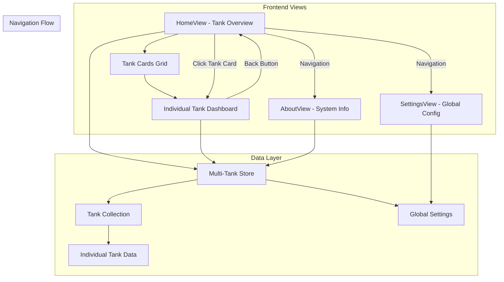
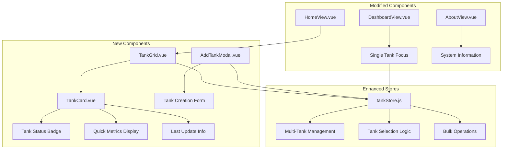
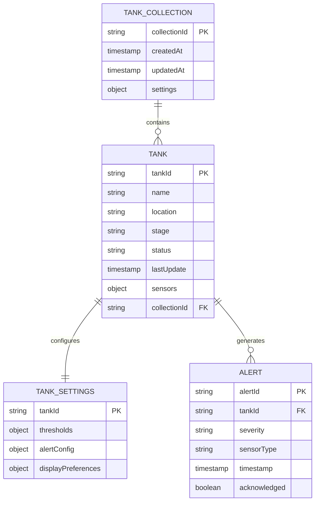
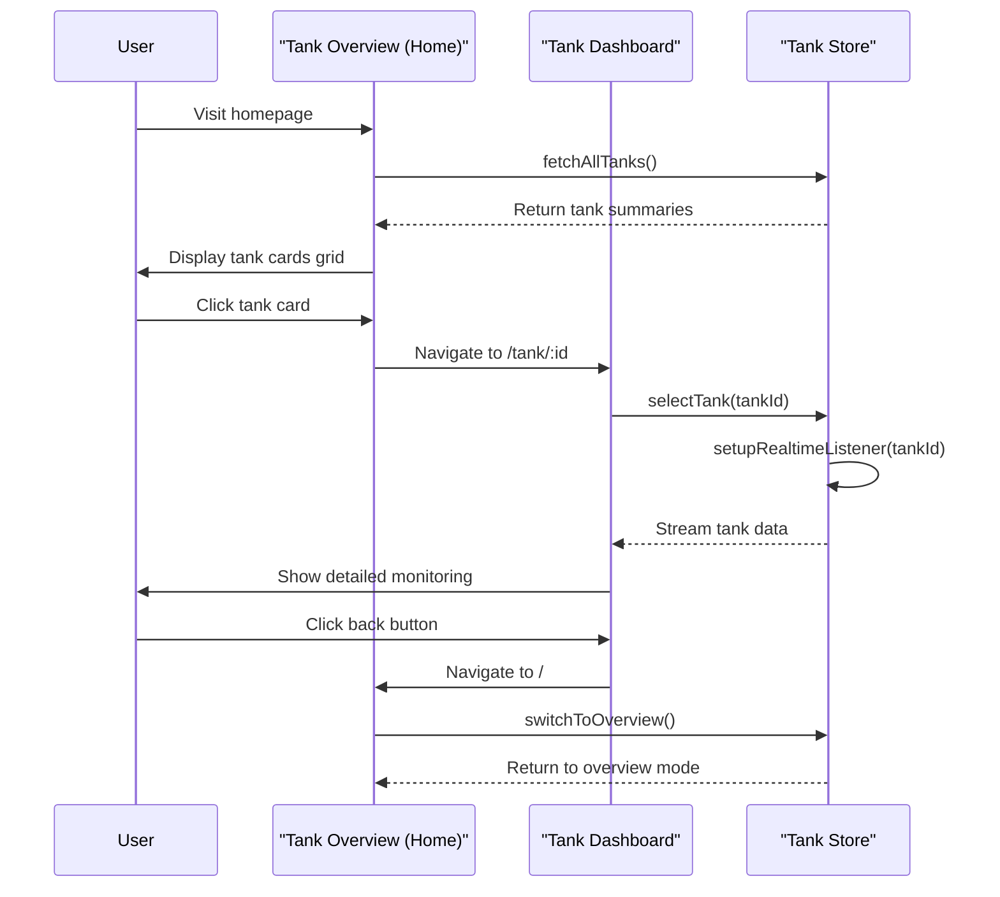
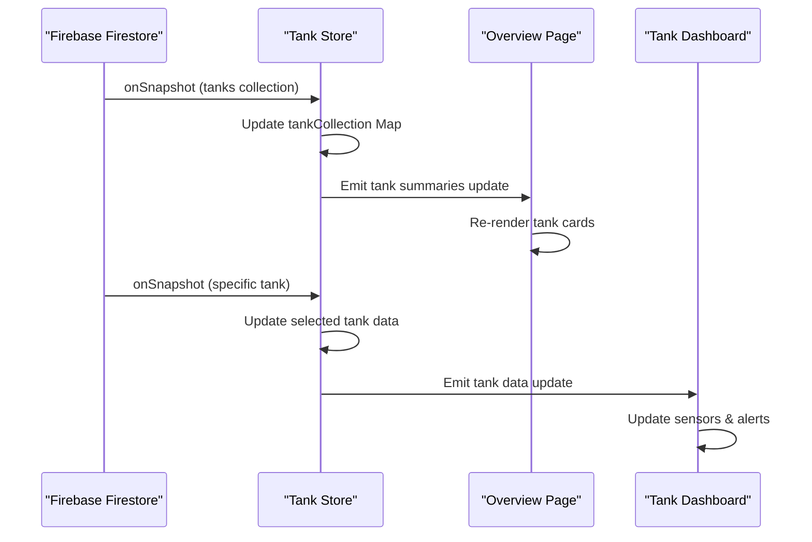

# Multi-Tank Overview & Individual Dashboard System

## Overview

This design transforms the Smartfish application from a single-tank monitoring system into a comprehensive multi-tank management platform. The system will feature a tank overview homepage with interactive cards, individual tank dashboards, and a reorganized navigation structure.

## Architecture

### System Components Overview



### Component Architecture



## Component Specifications

### TankCard Component

**Purpose**: Display tank summary information in a card format for the overview grid.

**Props Interface**:

```typescript
interface TankCardProps {
  tank: {
    id: string;
    name: string;
    location: string;
    stage: string;
    status: 'healthy' | 'warning' | 'critical';
    lastUpdate: string;
    sensors: {
      temperature: number;
      ph: number;
      oxygen: number;
      salinity: number;
    };
    alertCount: number;
  };
  showQuickActions?: boolean;
}
```

**Visual Elements**:

- Water-themed teal color scheme based on status
- Glass morphism card design with floating effects
- Status indicator with color-coded badges
- Mini sensor metrics grid
- Hover animations and click feedback
- Last update timestamp with relative time display

**Interaction Behavior**:

- Click navigates to individual tank dashboard
- Hover shows quick action buttons (settings, alerts)
- Long press/right-click shows context menu
- Touch-friendly design for mobile devices

### TankGrid Component

**Purpose**: Container component managing the tank cards layout and grid functionality.

**Features**:

- Responsive grid layout (1-4 columns based on screen size)
- Add new tank button prominently displayed
- Search and filter functionality
- Sort options (name, status, last update, alert count)
- Empty state handling with onboarding guidance

**Layout Patterns**:

```
Desktop (4 columns):
[Tank A] [Tank B] [Tank C] [Tank D]
[Tank E] [Tank F] [Add +] [      ]

Tablet (2 columns):
[Tank A] [Tank B]
[Tank C] [Tank D]
[Add +]  [      ]

Mobile (1 column):
[Tank A]
[Tank B]
[Tank C]
[Add +]
```

### Individual Tank Dashboard

**Route Structure**:

- `/tank/:tankId` - Individual tank monitoring view
- Maintains current dashboard functionality but scoped to selected tank
- Back navigation to tank overview
- Tank selector dropdown in header for quick switching

**Enhanced Features**:

- Tank-specific breadcrumb navigation
- Quick switch between tanks without returning to overview
- Deep linking support for direct tank access
- Tank comparison mode (split view for 2 tanks)

## Data Models & State Management

### Enhanced Tank Store Architecture



### Store State Structure

```javascript
// Enhanced tankStore.js
const state = {
  // Current state (existing)
  tankData: ref({}),
  selectedTankId: ref('central-tank'),

  // New multi-tank state
  tankCollection: ref(new Map()),
  activeTanks: computed(() => Array.from(tankCollection.value.values())),
  tankSummaries: computed(() => generateTankSummaries()),

  // Global settings
  globalSettings: ref({
    autoRefreshInterval: 30000,
    alertSound: true,
    darkMode: false,
    defaultView: 'overview',
  }),

  // UI state
  isOverviewMode: ref(true),
  selectedTanks: ref(new Set()),
  filterCriteria: ref({
    status: 'all',
    searchTerm: '',
    sortBy: 'name',
  }),
};
```

### Store Actions

```javascript
// Tank Collection Management
const actions = {
  // Existing actions enhanced for multi-tank
  async fetchTankData(tankId),
  async setupRealtimeListener(tankId),

  // New multi-tank actions
  async fetchAllTanks(),
  async createTank(tankConfig),
  async deleteTank(tankId),
  async duplicateTank(sourceTankId, newName),

  // Tank Selection & Navigation
  selectTank(tankId),
  selectMultipleTanks(tankIds),
  switchToOverview(),

  // Bulk Operations
  async bulkUpdateThresholds(tankIds, thresholds),
  async bulkAcknowledgeAlerts(tankIds),
  async exportMultipleTanks(tankIds),

  // Filtering & Search
  setFilterCriteria(criteria),
  searchTanks(searchTerm),
  sortTanks(sortMethod)
}
```

## Navigation & Routing

### Enhanced Route Configuration

```javascript
const routes = [
  {
    path: '/',
    name: 'Home',
    component: HomeView, // Now tank overview grid
    meta: {
      title: 'Tank Overview - Smartfish',
      description: 'Overview of all registered tanks and their status',
    },
  },
  {
    path: '/tank/:tankId',
    name: 'TankDashboard',
    component: DashboardView, // Individual tank dashboard
    props: true,
    meta: {
      title: 'Tank Dashboard - Smartfish',
      description: 'Detailed monitoring for individual tank',
    },
  },
  {
    path: '/about',
    name: 'About',
    component: AboutView, // Moved from current HomeView
    meta: {
      title: 'About Smartfish - Aquaculture Monitoring',
      description: 'Learn about Smartfish monitoring system features',
    },
  },
  {
    path: '/settings',
    name: 'Settings',
    component: SettingsView,
    meta: {
      title: 'Global Settings - Smartfish',
    },
  },
  {
    path: '/dashboard',
    redirect: '/', // Legacy route redirect
  },
];
```

### Navigation Flow



## UI/UX Design Specifications

### Tank Overview Homepage Design

**Layout Structure**:

- Header with app branding and navigation
- Search/filter bar with sorting controls
- Responsive tank cards grid
- Floating "Add Tank" action button
- Quick statistics summary bar

**Visual Design Elements**:

- Water-themed teal color palette consistency
- Glass morphism effects on tank cards
- Subtle water ripple animations on hover
- Status-based color coding (green/yellow/red)
- Clean, modern typography with proper hierarchy

**Responsive Breakpoints**:

```css
/* Mobile: 1 column */
@media (max-width: 640px) {
  .tank-grid {
    grid-template-columns: 1fr;
  }
}

/* Tablet: 2 columns */
@media (min-width: 641px) and (max-width: 1024px) {
  .tank-grid {
    grid-template-columns: repeat(2, 1fr);
  }
}

/* Desktop: 3-4 columns */
@media (min-width: 1025px) {
  .tank-grid {
    grid-template-columns: repeat(auto-fit, minmax(300px, 1fr));
  }
}
```

### Tank Card Design Specifications

**Card Dimensions**:

- Minimum width: 280px
- Aspect ratio: 4:3
- Padding: 24px
- Border radius: 16px

**Content Hierarchy**:

1. Tank status badge (top-right)
2. Tank name and location (header)
3. Mini sensor metrics (2x2 grid)
4. Last update timestamp (footer)
5. Alert indicator (if active)

**Interactive States**:

- Default: Subtle shadow, clean appearance
- Hover: Elevated shadow, scale transform (1.02x)
- Active: Border highlight in primary teal
- Loading: Skeleton animation
- Error: Red border with error icon

### Individual Tank Dashboard Enhancements

**Header Modifications**:

- Tank selector dropdown for quick switching
- Breadcrumb navigation (Overview > Tank Name)
- Back to overview button
- Tank-specific quick actions

**Layout Preservation**:

- Maintain existing dashboard grid structure
- Keep current component arrangement
- Preserve real-time monitoring functionality
- Enhance with tank-specific context

## Data Flow & Synchronization

### Real-time Data Synchronization



### Firebase Data Structure

```javascript
// Firestore collections structure
const firestoreStructure = {
  tanks: {
    [tankId]: {
      name: string,
      location: string,
      stage: string,
      status: string,
      lastUpdate: timestamp,
      sensors: {
        temperature: number,
        ph: number,
        oxygen: number,
        salinity: number,
      },
      settings: {
        thresholds: object,
        alertConfig: object,
      },
    },
  },

  tankHistory: {
    [tankId]: {
      readings: {
        [timestamp]: {
          sensors: object,
          alerts: array,
        },
      },
    },
  },
};
```

## Migration Strategy

### Phase 1: Core Infrastructure

1. Enhance tankStore for multi-tank support
2. Create TankCard and TankGrid components
3. Modify routing configuration
4. Update Firebase data structure

### Phase 2: View Transformation

1. Transform HomeView to tank overview
2. Enhance DashboardView for individual tanks
3. Create AboutView with moved content
4. Update navigation components

### Phase 3: Enhanced Features

1. Implement tank creation/deletion
2. Add search and filtering
3. Implement bulk operations
4. Add comparison features

### Phase 4: Testing & Optimization

1. Unit test new components
2. Integration testing for multi-tank flows
3. Performance optimization
4. Accessibility compliance verification

## Testing Strategy

### Component Testing

- TankCard component rendering with different tank states
- TankGrid layout responsiveness across breakpoints
- Navigation flow between overview and individual dashboards
- Real-time data synchronization testing

### Integration Testing

- Multi-tank store operations
- Firebase data synchronization
- Route navigation and parameter handling
- Bulk operations functionality

### User Experience Testing

- Tank creation and management workflows
- Search and filtering performance
- Mobile responsiveness validation
- Accessibility compliance (WCAG AA standards)

## Performance Considerations

### Optimization Strategies

- Lazy loading for tank history data
- Virtual scrolling for large tank collections
- Debounced search and filtering
- Efficient re-rendering with Vue 3 reactivity

### Memory Management

- Cleanup of unused tank listeners
- Efficient store state updates
- Component lifecycle optimization
- Image and asset optimization

### Loading States

- Skeleton loading for tank cards
- Progressive data loading
- Optimistic UI updates
- Error boundary implementation
