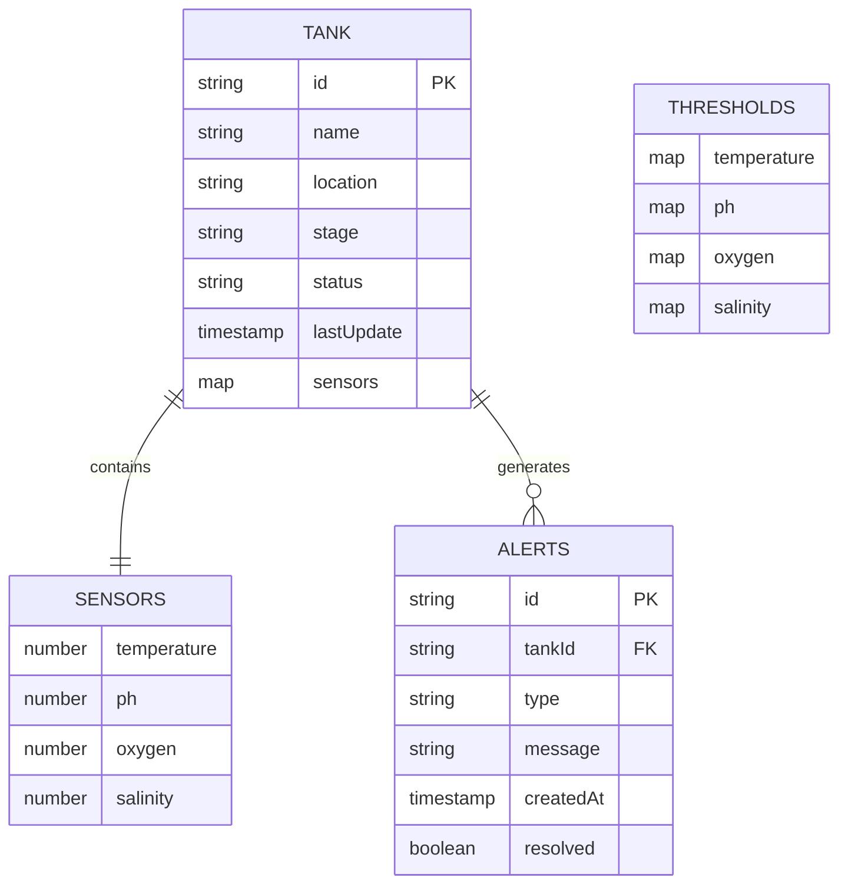
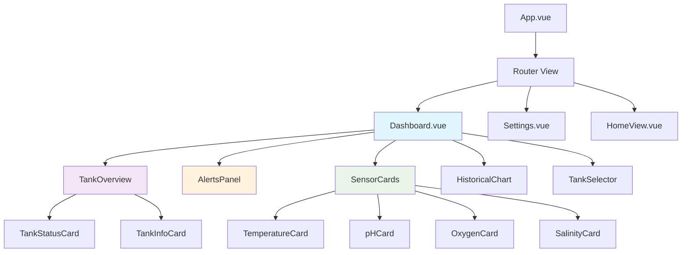
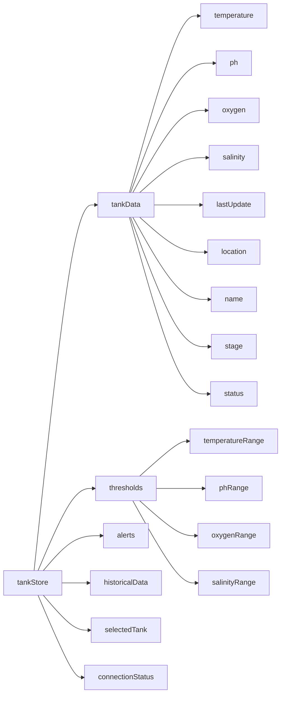
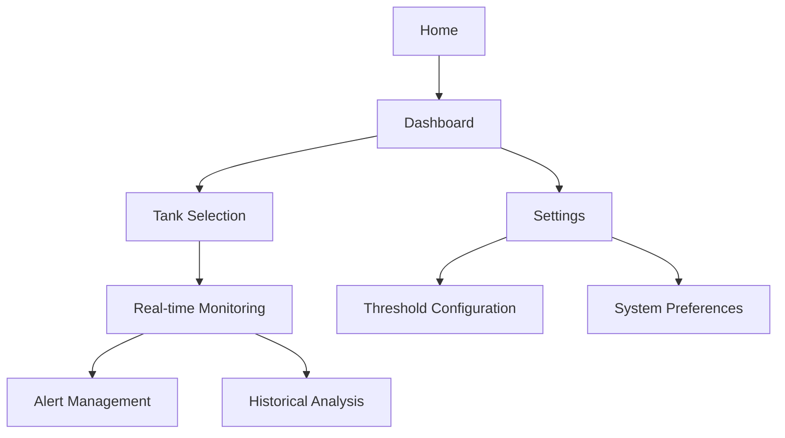

# Tank Monitoring System Design

## Overview

The SmartFish Tank Monitoring System is a real-time dashboard application designed for aquaculture management. The system provides continuous monitoring of critical water parameters including temperature, pH, oxygen levels, and salinity across multiple fish tanks. Built with Vue 3 and Firebase, it offers a modern, responsive interface for fish farm operators to ensure optimal growing conditions and early detection of potential issues.

### Core Value Proposition

- Real-time monitoring of critical water parameters
- Automated alert system for out-of-range conditions
- Historical data visualization and trend analysis
- Multi-tank management with scalable architecture
- Mobile-responsive design for field operations

## Technology Stack & Dependencies

### Frontend Framework

- **Vue 3.5.18** - Composition API with reactive state management
- **Vite 7.0.6** - Fast build tool and development server
- **Pinia 3.0.3** - Centralized state management
- **Vue Router 4.5.1** - Client-side routing

### UI & Visualization

- **Tailwind CSS 4.1.11** - Utility-first styling framework
- **Chart.js 4.5.0** - Data visualization library
- **vue-chartjs 5.3.2** - Vue wrapper for Chart.js

### Backend & Database

- **Firebase 12.1.0** - Backend-as-a-Service
- **Firestore** - NoSQL document database for tank data
- **Firebase Realtime Database** - Real-time synchronization

## Component Architecture

### Data Model Schema



### Component Hierarchy



### Core Components Definition

#### 1. Dashboard.vue (Main Container)

**Purpose**: Primary dashboard orchestrating all monitoring components

**Props**: None (root dashboard component)

**State Management**:

- Connects to tankStore for real-time data
- Manages selected tank context
- Controls refresh intervals

**Key Features**:

- Real-time data polling every 30 seconds
- Responsive grid layout for sensor cards
- Tank selection dropdown
- Auto-refresh toggle

#### 2. TankOverview Component

**Props**:

- `tankId: string` - Selected tank identifier
- `tankData: Object` - Current tank information

**State**:

- Tank metadata (name, location, stage, status)
- Last update timestamp
- Connection status indicator

**Layout**: Header section with tank information and status indicators

#### 3. SensorCards Component Collection

**Temperature Card**:

- Range: 20°C - 30°C (configurable)
- Visual: Thermometer icon with color coding
- Alert states: Blue (cold), Green (optimal), Red (hot)

**pH Card**:

- Range: 6.5 - 8.5 (configurable)
- Visual: pH scale indicator
- Alert states: Red (acidic), Green (neutral), Purple (alkaline)

**Oxygen Card**:

- Range: 5-8 mg/L (configurable)
- Visual: Bubble animation for current levels
- Alert states: Red (low), Green (optimal), Yellow (high)

**Salinity Card** (New Addition):

- Range: 25-35 ppt (configurable for marine species)
- Visual: Salt crystal icon with gradient
- Alert states: Blue (low), Green (optimal), Orange (high)

#### 4. AlertsPanel Component

**Enhanced Features**:

- Priority-based alert sorting (Critical, Warning, Info)
- Alert acknowledgment system
- Auto-dismissal for resolved conditions
- Sound notifications toggle
- Historical alerts log

#### 5. HistoricalChart Component

**Chart Types**:

- Multi-line chart for all parameters
- Selectable time ranges (1H, 6H, 24H, 7D, 30D)
- Zoom and pan functionality
- Threshold lines overlay
- Export functionality (PNG, CSV)

## State Management Architecture

### Pinia Store Structure



### Enhanced Store Actions

```javascript
// tankStore.js enhanced methods
export const useTankStore = defineStore('tank', () => {
  // State
  const selectedTankId = ref('tank1')
  const tanksData = ref(new Map())
  const connectionStatus = ref('connected')
  const alertHistory = ref([])

  // Actions
  async function fetchTankData(tankId) {
    // Firestore integration for real-time updates
  }

  async function fetchMultipleTanks() {
    // Load all available tanks
  }

  function updateThresholds(sensor, min, max) {
    // Dynamic threshold updates
  }

  function acknowledgeAlert(alertId) {
    // Mark alerts as acknowledged
  }

  function exportHistoricalData(format, timeRange) {
    // Data export functionality
  }
})
```

## Routing & Navigation

### Route Configuration

| Route                | Component       | Purpose                           |
| -------------------- | --------------- | --------------------------------- |
| `/`                  | HomeView.vue    | Landing page with system overview |
| `/dashboard`         | Dashboard.vue   | Main monitoring interface         |
| `/dashboard/:tankId` | Dashboard.vue   | Tank-specific dashboard           |
| `/settings`          | Settings.vue    | Configuration and thresholds      |
| `/history`           | HistoryView.vue | Historical data analysis          |
| `/alerts`            | AlertsView.vue  | Alert management interface        |

### Navigation Flow



## Styling Strategy

### Design System

#### Color Palette

- **Primary**: `#0ea5e9` (Sky Blue) - Trust, reliability
- **Secondary**: `#10b981` (Emerald) - Health, growth
- **Accent**: `#f59e0b` (Amber) - Attention, warnings
- **Error**: `#ef4444` (Red) - Critical alerts
- **Success**: `#22c55e` (Green) - Optimal conditions

#### Typography Scale

- **Headings**: Inter font family, weights 600-800
- **Body**: Inter font family, weight 400-500
- **Monospace**: JetBrains Mono for data values
- **Size Scale**: 12px, 14px, 16px, 18px, 24px, 32px, 48px

#### Component Styling Patterns

```css
/* Sensor Card Base Style */
.sensor-card {
  @apply bg-white rounded-lg shadow-md border border-gray-200 p-6 
         transition-all duration-300 hover:shadow-lg hover:-translate-y-1;
}

/* Alert State Variants */
.sensor-card--normal {
  @apply border-green-200 bg-green-50;
}
.sensor-card--warning {
  @apply border-yellow-200 bg-yellow-50;
}
.sensor-card--critical {
  @apply border-red-200 bg-red-50;
}

/* Data Value Display */
.sensor-value {
  @apply text-3xl font-bold font-mono text-gray-800 leading-none;
}

/* Responsive Grid Layout */
.dashboard-grid {
  @apply grid grid-cols-1 md:grid-cols-2 lg:grid-cols-4 gap-6;
}
```

## API Integration Layer

### Firebase Firestore Integration

#### Data Structure Mapping

```javascript
// Firestore Document Structure
{
  tanks: {
    [tankId]: {
      name: "Tanque central",
      location: "Desconhecida",
      stage: "Crescimento",
      status: "healthy",
      lastUpdate: "2025-08-14T19:14:08.771Z",
      sensors: {
        temperature: 26,
        ph: 6,
        oxygen: 8,
        salinity: 30
      }
    }
  },
  thresholds: {
    [tankId]: {
      temperature: { min: 22, max: 28 },
      ph: { min: 6.5, max: 7.5 },
      oxygen: { min: 6, max: 9 },
      salinity: { min: 28, max: 32 }
    }
  }
}
```

#### Real-time Synchronization

```javascript
// Enhanced Firebase integration
import { doc, onSnapshot, collection, query, orderBy, limit } from 'firebase/firestore'

class TankDataService {
  subscribeToTank(tankId, callback) {
    const tankDoc = doc(db, 'tanks', tankId)
    return onSnapshot(tankDoc, callback)
  }

  subscribeToHistoricalData(tankId, timeRange) {
    const historyRef = collection(db, 'tanks', tankId, 'history')
    const q = query(historyRef, orderBy('timestamp', 'desc'), limit(100))
    return onSnapshot(q, callback)
  }
}
```

## Testing Strategy

### Unit Testing Framework

- **Vitest** - Fast unit testing aligned with Vite
- **Vue Test Utils** - Vue component testing utilities
- **Testing Library** - User-centric testing approach

### Component Testing Approach

```javascript
// Example: SensorCard.test.js
describe('SensorCard Component', () => {
  test('displays correct temperature value and status', () => {
    const props = {
      sensorType: 'temperature',
      value: 25.5,
      unit: '°C',
      status: 'normal',
      thresholds: { min: 20, max: 30 },
    }

    render(SensorCard, { props })

    expect(screen.getByText('25.5°C')).toBeInTheDocument()
    expect(screen.getByRole('status')).toHaveClass('sensor-card--normal')
  })
})
```

### Integration Testing Scenarios

- Firebase connection and data synchronization
- Real-time alert generation and dismissal
- Historical data chart rendering with live updates
- Multi-tank switching and state management
- Threshold configuration persistence

### End-to-End Testing

- **Cypress** - Full user journey testing
- Critical paths: Dashboard loading → Tank selection → Alert acknowledgment → Settings update
