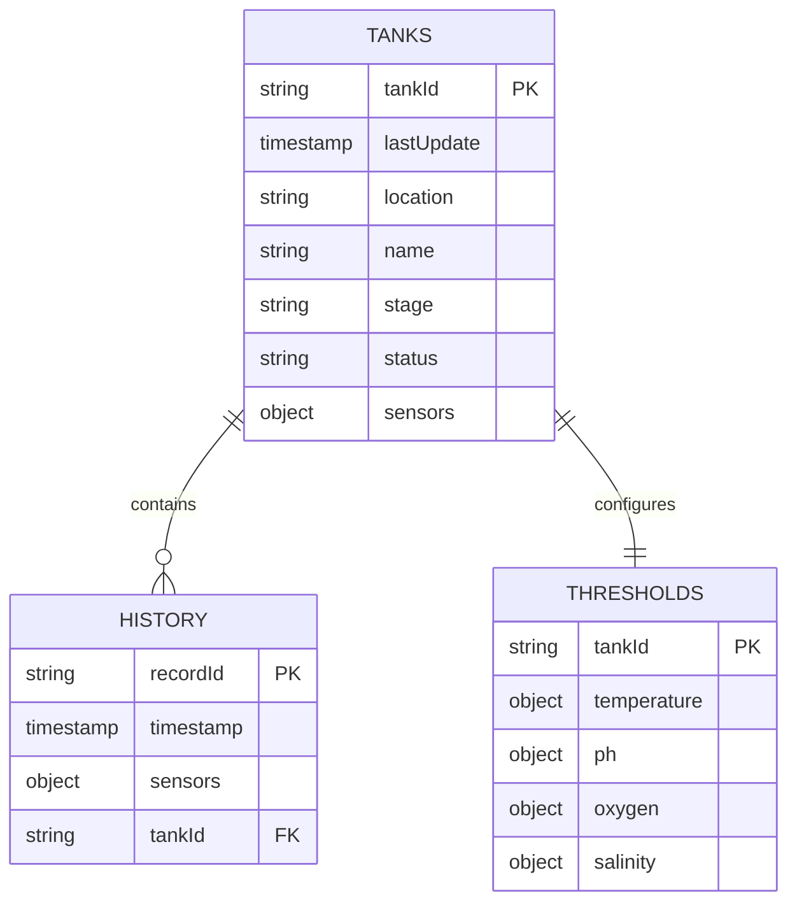
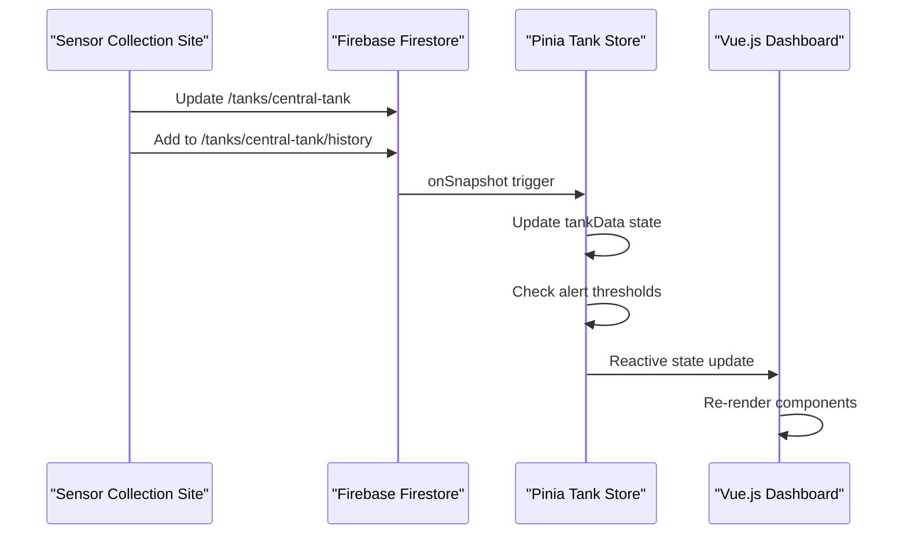
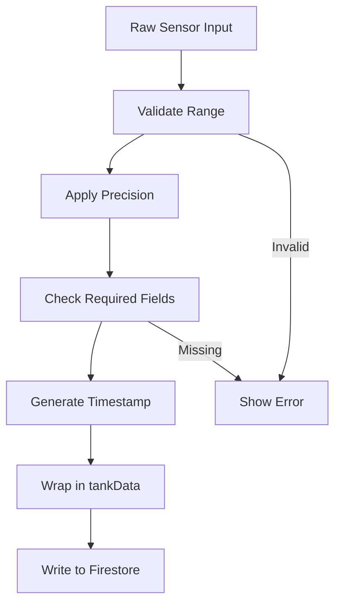

# Tank Sensor Data Collection Integration

## Overview

This design document outlines the integration of the external sensor data collection HTML site with the existing SmartFish tank monitoring system. The goal is to adapt the standalone sensor collection interface to properly write data to the correct Firestore document structure expected by the Vue.js application.

## Current System Architecture

The existing SmartFish system uses a Vue.js frontend with Pinia state management and Firebase Firestore for real-time data synchronization. The system expects specific document structures and data patterns.

### Existing Data Structure



### Current Document Structure

The Vue.js application expects this Firestore structure:

**Main Tank Document: `/tanks/central-tank`**

```json
{
  "tankData": {
    "lastUpdate": "2025-01-14T19:14:08.771Z",
    "location": "Desconhecida",
    "name": "Tanque central",
    "sensors": {
      "oxygen": 8.2,
      "ph": 7.1,
      "salinity": 30,
      "temperature": 26.5
    },
    "stage": "Crescimento",
    "status": "healthy"
  }
}
```

**Historical Data Subcollection: `/tanks/central-tank/history/{recordId}`**

```json
{
  "timestamp": "2025-01-14T19:14:08.771Z",
  "sensors": {
    "oxygen": 8.2,
    "ph": 7.1,
    "salinity": 30,
    "temperature": 26.5
  }
}
```

## Integration Design

### Data Flow Architecture



### Modified Sensor Collection Site

The current sensor collection site needs to be adapted to:

1. **Use correct Firebase configuration** - Match the existing project configuration
2. **Write to expected document structure** - Follow the tankData wrapper pattern
3. **Maintain historical data** - Add entries to the history subcollection
4. **Use consistent tank ID** - Default to "central-tank" to match the Vue.js app

### Key Modifications Required

#### 1. Firebase Configuration Alignment

**Current Issue**: The HTML site uses hardcoded Firebase config
**Solution**: Update to match the Vue.js app configuration or use environment variables

#### 2. Document Structure Compliance

**Current Issue**: The HTML site writes directly to tank fields
**Solution**: Wrap data in `tankData` object to match Vue.js expectations

```javascript
// Current (incorrect) structure
await setDoc(tankRef, {
  name: tankName,
  location: 'Desconhecida',
  sensors: {
    /* sensor data */
  },
});

// Required structure for Vue.js compatibility
await setDoc(
  tankRef,
  {
    tankData: {
      name: tankName,
      location: 'Desconhecida',
      lastUpdate: new Date().toISOString(),
      stage: 'Crescimento',
      status: 'healthy',
      sensors: {
        /* sensor data */
      },
    },
  },
  { merge: true }
);
```

#### 3. Tank ID Management

**Current Issue**: HTML site generates dynamic tank IDs
**Solution**: Use fixed "central-tank" ID or provide tank selection interface

#### 4. Historical Data Storage

**Current Issue**: HTML site stores history in `historicalData` subcollection
**Solution**: Change to `history` subcollection to match Vue.js expectations

```javascript
// Update historical data reference
const historyRef = collection(tankRef, 'history'); // Changed from 'historicalData'
```

## Implementation Strategy

### Phase 1: Configuration Alignment

1. **Update Firebase Configuration**
   - Use environment variables or match existing config
   - Ensure same project ID and authentication domain

2. **Standardize Tank ID**
   - Default to "central-tank" for immediate compatibility
   - Add tank selection dropdown for future flexibility

### Phase 2: Data Structure Compliance

1. **Modify Document Writing**
   - Wrap all tank data in `tankData` object
   - Include required fields: `lastUpdate`, `stage`, `status`
   - Maintain backward compatibility

2. **Update Historical Data Storage**
   - Change subcollection name from `historicalData` to `history`
   - Ensure timestamp format consistency (ISO 8601)

### Phase 3: Enhanced Integration

1. **Real-time Validation**
   - Add client-side threshold checking
   - Provide immediate feedback on sensor values

2. **Status Management**
   - Calculate tank status based on sensor readings
   - Update stage information when appropriate

## Data Validation & Transformation

### Input Validation Rules

| Sensor      | Min Value | Max Value | Unit | Precision |
| ----------- | --------- | --------- | ---- | --------- |
| pH          | 0.0       | 14.0      | -    | 1 decimal |
| Temperature | -10.0     | 50.0      | °C   | 1 decimal |
| Oxygen      | 0.0       | 20.0      | mg/L | 1 decimal |
| Salinity    | 0.0       | 50.0      | ppt  | 1 decimal |

### Data Transformation Pipeline



### Status Determination Logic

```javascript
function calculateTankStatus(sensors, thresholds) {
  const statuses = Object.keys(sensors).map(sensorType => {
    const value = sensors[sensorType];
    const threshold = thresholds[sensorType];

    if (value >= threshold.critical || value <= threshold.critical * 0.5) {
      return 'critical';
    } else if (value > threshold.max || value < threshold.min) {
      return 'warning';
    } else {
      return 'normal';
    }
  });

  if (statuses.includes('critical')) return 'critical';
  if (statuses.includes('warning')) return 'warning';
  return 'healthy';
}
```

## Testing Strategy

### Unit Testing

1. **Data Validation Tests**
   - Test sensor value range validation
   - Test required field validation
   - Test data type conversion

2. **Firestore Integration Tests**
   - Test document structure compliance
   - Test historical data storage
   - Test concurrent write operations

### Integration Testing

1. **Vue.js Compatibility Tests**
   - Verify real-time updates in dashboard
   - Test alert generation
   - Validate historical chart display

2. **Cross-browser Testing**
   - Test Firebase compatibility across browsers
   - Validate form submission behavior
   - Check responsive design

### Performance Testing

1. **Write Operation Performance**
   - Test concurrent sensor data submissions
   - Measure Firestore write latency
   - Monitor connection stability

2. **Real-time Synchronization**
   - Test Vue.js listener response time
   - Measure UI update performance
   - Validate data consistency

## Security Considerations

### Firebase Security Rules

```javascript
// Firestore Security Rules for tanks collection
rules_version = '2';
service cloud.firestore {
  match /databases/{database}/documents {
    match /tanks/{tankId} {
      allow read, write: if request.auth != null;

      match /history/{recordId} {
        allow read, write: if request.auth != null;
      }
    }
  }
}
```

### Input Sanitization

1. **Tank Name Validation**
   - Remove special characters
   - Limit length to 30 characters
   - Prevent SQL injection patterns

2. **Sensor Value Sanitization**
   - Parse as float with error handling
   - Apply min/max constraints
   - Reject non-numeric input

## Deployment Considerations

### Environment Configuration

1. **Development Environment**
   - Use development Firebase project
   - Enable debug logging
   - Mock sensor data for testing

2. **Production Environment**
   - Use production Firebase project
   - Enable analytics and monitoring
   - Implement error reporting

### Monitoring & Alerts

1. **System Health Monitoring**
   - Monitor Firestore write success rate
   - Track connection status
   - Alert on repeated failures

2. **Data Quality Monitoring**
   - Validate sensor reading ranges
   - Monitor data freshness
   - Alert on missing sensor updates

## Migration Strategy

### Backward Compatibility

1. **Existing Data Preservation**
   - Maintain existing document structure
   - Provide data migration scripts
   - Ensure gradual transition

2. **API Compatibility**
   - Support both old and new data structures
   - Provide adapter functions
   - Maintain client compatibility

### Rollback Plan

1. **Configuration Rollback**
   - Maintain previous Firebase configuration
   - Provide quick revert mechanism
   - Document rollback procedures

2. **Data Recovery**
   - Implement data backup before migration
   - Provide data restoration tools
   - Test recovery procedures
