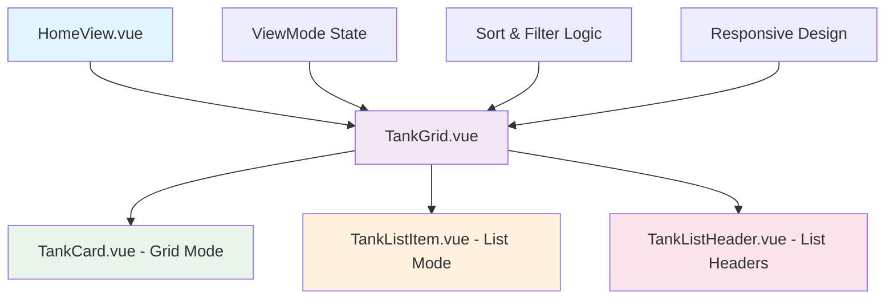
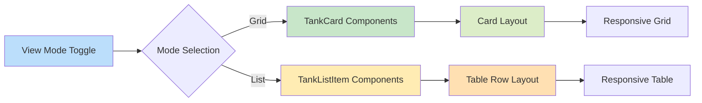
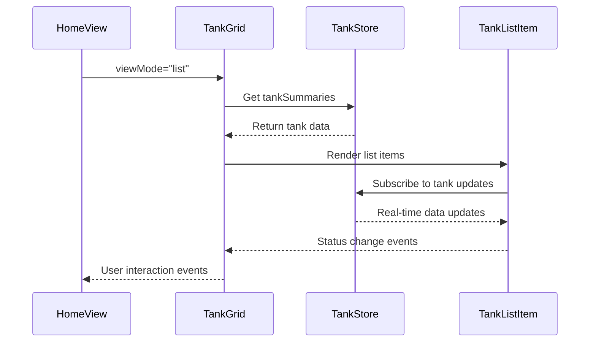

# Tanks List Mode Implementation

## Overview

The Smart Fish monitoring system currently displays tanks in a grid layout on the HomeView page. While the view mode toggle exists with options for "Grade" (grid) and "Lista" (list), the list mode functionality is not implemented. This design outlines the implementation of a comprehensive list view mode that provides a more detailed, table-like display of tank information suitable for data analysis and bulk operations.

## Architecture

### Component Structure

The implementation will enhance the existing component hierarchy:



### State Management Integration

The list mode will leverage the existing tankStore for:

- Tank data collection (`tankSummaries`)
- Real-time status updates
- Alert management
- Connection status monitoring

### Display Mode Architecture



## Component Specifications

### Enhanced TankGrid Component

The TankGrid component will be modified to support both display modes:

**Props Addition:**

- `viewMode`: String ('grid' | 'list') - determines rendering mode
- `showCompactView`: Boolean - enables compact list display
- `sortableColumns`: Array - defines which columns support sorting in list mode

**Template Structure:**

```vue
<template>
  <div class="tank-display-container">
    <!-- Existing header and controls -->

    <!-- Grid Mode (Existing) -->
    <div v-if="viewMode === 'grid'" class="tank-grid">
      <TankCard v-for="tank in paginatedTanks" ... />
    </div>

    <!-- List Mode (New) -->
    <div v-else-if="viewMode === 'list'" class="tank-list">
      <TankListHeader :sortBy="sortBy" :sortOrder="sortOrder" />
      <TankListItem v-for="tank in paginatedTanks" ... />
    </div>
  </div>
</template>
```

### New TankListHeader Component

Provides sortable column headers for list mode:

**Features:**

- Click-to-sort functionality
- Visual sort direction indicators
- Responsive column widths
- Accessibility support (ARIA labels)

**Column Structure:**

- Tank Name & Location
- Status Indicator
- Temperature
- pH Level
- Oxygen (O₂)
- Salinity
- Last Update
- Alert Count
- Quick Actions

### New TankListItem Component

Displays tank data in a table row format with proper event handling:

**Template Structure:**

```vue
<template>
  <tr
    @click="handleRowClick"
    class="tank-list-item hover:bg-gray-50 cursor-pointer transition-colors"
    :class="rowStatusClass"
  >
    <!-- Tank Name & Location -->
    <td class="px-4 py-3">
      <div class="flex flex-col">
        <span class="font-medium text-gray-900">{{ tank.name }}</span>
        <span class="text-sm text-gray-500">{{ tank.location }}</span>
      </div>
    </td>

    <!-- Status -->
    <td class="px-4 py-3">
      <div class="flex items-center space-x-2">
        <div class="w-3 h-3 rounded-full" :class="statusIndicatorClass"></div>
        <span class="text-sm font-medium" :class="statusTextClass">
          {{ statusText }}
        </span>
      </div>
    </td>

    <!-- Sensor Values -->
    <td class="px-4 py-3 text-center">{{ tank.sensors.temperature }}°C</td>
    <td class="px-4 py-3 text-center">{{ tank.sensors.ph }}</td>
    <td class="px-4 py-3 text-center">{{ tank.sensors.oxygen }} mg/L</td>
    <td class="px-4 py-3 text-center">{{ tank.sensors.salinity }} ppt</td>

    <!-- Last Update -->
    <td class="px-4 py-3 text-sm text-gray-500">
      {{ formattedLastUpdate }}
    </td>

    <!-- Alert Count -->
    <td class="px-4 py-3 text-center">
      <span
        v-if="tank.alertCount > 0"
        class="inline-flex items-center px-2 py-1 rounded-full text-xs font-medium bg-red-100 text-red-800"
      >
        {{ tank.alertCount }}
      </span>
      <span v-else class="text-gray-400">—</span>
    </td>

    <!-- Actions -->
    <td class="px-4 py-3">
      <div class="flex items-center space-x-2">
        <button
          @click="handleActionClick($event, 'settings')"
          class="p-1 text-gray-400 hover:text-primary-teal transition-colors"
          :aria-label="`Configurações do ${tank.name}`"
        >
          <CogIcon class="w-4 h-4" />
        </button>
        <button
          @click="handleActionClick($event, 'alerts')"
          :disabled="tank.alertCount === 0"
          class="p-1 text-gray-400 hover:text-red-600 transition-colors disabled:opacity-50 disabled:cursor-not-allowed"
          :aria-label="`Alertas do ${tank.name}`"
        >
          <BellIcon class="w-4 h-4" />
        </button>
        <button
          @click="handleActionClick($event, 'export')"
          class="p-1 text-gray-400 hover:text-accent-teal transition-colors"
          :aria-label="`Exportar dados do ${tank.name}`"
        >
          <ArrowDownTrayIcon class="w-4 h-4" />
        </button>
      </div>
    </td>
  </tr>
</template>
```

**Event Handling Methods:**

```javascript
const handleRowClick = () => {
  // Navigate to tank details only if not clicking on action buttons
  router.push(`/tank/${props.tank.id}`);
};

const handleActionClick = (event, action) => {
  // Prevent event bubbling to row click handler
  event.stopPropagation();
  event.preventDefault();

  // Emit specific action event
  emit(`${action}-clicked`, props.tank.id);
};
```

**Responsive Behavior:**

- Desktop: Full table with all columns
- Tablet: Hide salinity and detailed location
- Mobile: Stack important info, hide non-critical columns

### Data Flow Architecture



## List Mode Features

### Column Definitions

| Column      | Desktop | Tablet | Mobile | Sortable | Description                               |
| ----------- | ------- | ------ | ------ | -------- | ----------------------------------------- |
| Tank Name   | ✓       | ✓      | ✓      | ✓        | Primary identifier with location sub-text |
| Status      | ✓       | ✓      | ✓      | ✓        | Visual status indicator with color coding |
| Temperature | ✓       | ✓      | ✓      | ✓        | Current temperature reading               |
| pH Level    | ✓       | ✓      | ✓      | ✓        | Current pH measurement                    |
| Oxygen      | ✓       | ✓      | -      | ✓        | Dissolved oxygen level                    |
| Salinity    | ✓       | -      | -      | ✓        | Water salinity measurement                |
| Last Update | ✓       | ✓      | ✓      | ✓        | Time since last sensor reading            |
| Alert Count | ✓       | ✓      | ✓      | ✓        | Number of active alerts                   |
| Actions     | ✓       | ✓      | ✓      | -        | Quick action buttons                      |

### Sorting Capabilities

**Primary Sort Options:**

- Name (A-Z, Z-A)
- Status (Critical → Healthy, Healthy → Critical)
- Temperature (Low → High, High → Low)
- pH Level (Low → High, High → Low)
- Oxygen Level (Low → High, High → Low)
- Last Update (Recent → Old, Old → Recent)
- Alert Count (High → Low, Low → High)

**Multi-level Sorting:**

- Primary: Status (Critical first)
- Secondary: Alert count (Descending)
- Tertiary: Name (Alphabetical)

### Visual Design Specifications

#### Color Coding System

- **Critical Status**: Red background (#fef2f2), red text (#991b1b)
- **Warning Status**: Yellow background (#fffbeb), yellow text (#92400e)
- **Healthy Status**: Green background (#f0fdf4), green text (#166534)
- **Disconnected**: Gray background (#f9fafb), gray text (#374151)

#### Status Indicators

- **Critical**: Red pulsing dot with "Crítico" label
- **Warning**: Yellow solid dot with "Atenção" label
- **Healthy**: Green solid dot with "Saudável" label
- **Error**: Gray dot with "Desconectado" label

#### Interactive Elements

- **Hover Effects**: Row highlighting on hover
- **Click Actions**: Row click navigates to tank details
- **Action Prevention**: Click events on buttons prevent row navigation
- **Button States**: Disabled states for tanks without alerts
- **Loading States**: Shimmer effects during data loading
- **Event Propagation**: Stop event bubbling for action buttons

### Responsive Layout Strategy

#### Desktop (≥1024px)

```
| Tank Name        | Status   | Temp | pH  | O₂  | Sal | Updated | Alerts | Actions |
| 200px            | 100px    | 80px | 80px| 80px| 80px| 120px   | 80px   | 120px   |
```

#### Tablet (768px - 1023px)

```
| Tank Name        | Status   | Temp | pH  | O₂  | Updated | Alerts | Actions |
| 200px            | 100px    | 80px | 80px| 80px| 120px   | 80px   | 100px   |
```

#### Mobile (≤767px)

```
| Tank Name        | Status   | Temp/pH | Alerts | Actions |
| 150px            | 80px     | 100px   | 60px   | 80px    |
```

## Technical Implementation

### Component State Management

```javascript
// TankGrid.vue - Enhanced state
const viewMode = defineModel('viewMode', {
  type: String,
  default: 'grid',
  validator: value => ['grid', 'list'].includes(value),
});

const listSortBy = ref('status'); // Default sort by status
const listSortOrder = ref('asc');
const compactView = ref(false);

// Computed for list-specific sorting
const sortedTanksForList = computed(() => {
  if (viewMode.value !== 'list') return filteredTanks.value;

  return [...filteredTanks.value].sort((a, b) => {
    // Multi-level sorting logic
    // 1. Status priority (critical > warning > healthy)
    // 2. Alert count (descending)
    // 3. Name (alphabetical)
  });
});
```

### Performance Optimizations

#### Virtual Scrolling

For large tank collections (>100 tanks):

```javascript
// Implement virtual scrolling for list mode
const visibleRange = ref({ start: 0, end: 20 });
const rowHeight = 60; // pixels
const containerHeight = ref(800);

const visibleTanks = computed(() => {
  return sortedTanksForList.value.slice(
    visibleRange.value.start,
    visibleRange.value.end
  );
});
```

#### Memoization

```javascript
// Memoize expensive computations
const memoizedTankStatus = computed(() => {
  return new Map(
    tanks.value.map(tank => [tank.id, calculateTankStatus(tank.sensors)])
  );
});
```

### Accessibility Implementation

#### ARIA Labels and Roles

```html
<table role="table" aria-label="Lista de tanques de monitoramento">
  <thead role="rowgroup">
    <tr role="row">
      <th
        role="columnheader"
        aria-sort="ascending"
        tabindex="0"
        @click="sortBy('name')"
        @keydown.enter="sortBy('name')"
      >
        Nome do Tanque
      </th>
    </tr>
  </thead>
  <tbody role="rowgroup">
    <tr
      role="row"
      :aria-label="`Tanque ${tank.name}, status ${tank.status}`"
      tabindex="0"
    >
      <!-- Row content -->
    </tr>
  </tbody>
</table>
```

#### Screen Reader Support

- Descriptive ARIA labels for each tank row
- Status announcements for real-time updates
- Keyboard navigation support
- Focus management for modal interactions

### Animation and Transitions

#### View Mode Transition

```css
.view-transition-enter-active,
.view-transition-leave-active {
  transition: all 0.3s cubic-bezier(0.4, 0, 0.2, 1);
}

.view-transition-enter-from {
  opacity: 0;
  transform: translateY(20px);
}

.view-transition-leave-to {
  opacity: 0;
  transform: translateY(-20px);
}
```

#### Row Animations

```css
.list-item-enter-active {
  transition: all 0.4s ease-out;
}

.list-item-enter-from {
  opacity: 0;
  transform: translateX(-20px);
}

.list-item-leave-active {
  transition: all 0.3s ease-in;
}

.list-item-leave-to {
  opacity: 0;
  transform: translateX(20px);
}

/* Prevent text selection on row hover */
.tank-list-item {
  user-select: none;
}

/* Allow text selection within action buttons */
.action-button {
  user-select: auto;
}

/* Prevent row click when clicking on actions */
.action-button {
  pointer-events: auto;
  position: relative;
  z-index: 10;
}

/* Disabled state for action buttons */
.action-button:disabled {
  pointer-events: none;
  opacity: 0.5;
  cursor: not-allowed;
}

/* Focus indicators for action buttons */
.action-button:focus {
  outline: 2px solid var(--primary-teal);
  outline-offset: 2px;
  border-radius: 4px;
}

/* Hover state that doesn't trigger on disabled buttons */
.action-button:not(:disabled):hover {
  background-color: rgba(var(--primary-teal-rgb), 0.1);
}
```

## User Experience Enhancements

### Batch Operations

Enable bulk actions in list mode:

- Select multiple tanks via checkboxes
- Bulk acknowledge alerts
- Export selected tank data
- Apply settings to multiple tanks

### Quick Actions Menu

Each row includes contextual actions with proper event handling:

- View Details (navigate to tank dashboard)
- Configure Settings (prevents row click)
- View/Acknowledge Alerts (prevents row click)
- Export Tank Data (prevents row click)
- Toggle Monitoring (prevents row click)

#### Event Handling Strategy

```javascript
// Prevent row navigation when clicking action buttons
const handleActionClick = (event, action) => {
  event.stopPropagation(); // Prevent row click
  event.preventDefault(); // Prevent default behavior

  // Execute specific action
  switch (action) {
    case 'settings':
      emit('settings-clicked', tank.id);
      break;
    case 'alerts':
      emit('alerts-clicked', tank.id);
      break;
    case 'export':
      exportTankData(tank.id);
      break;
  }
};

// Row click handler (only triggers if not clicking actions)
const handleRowClick = () => {
  navigateToTank(tank.id);
};
```

### Filtering Integration

Enhanced filtering for list view:

- Status-based filters with counters
- Date range filters for last update
- Alert severity filters
- Custom sensor value ranges

### Keyboard Shortcuts

- `Ctrl/Cmd + L`: Switch to list view
- `Ctrl/Cmd + G`: Switch to grid view
- `↑/↓`: Navigate between tanks in list
- `Enter`: Open selected tank (when row is focused)
- `Space`: Select/deselect tank for batch operations
- `Tab`: Navigate to action buttons within row
- `Escape`: Cancel action or deselect tank

#### Keyboard Navigation Behavior

```javascript
const handleKeyDown = event => {
  switch (event.key) {
    case 'Enter':
      if (event.target.closest('.action-button')) {
        // If focus is on action button, trigger that action
        event.preventDefault();
        event.stopPropagation();
      } else {
        // If focus is on row, navigate to tank
        handleRowClick();
      }
      break;
    case 'Escape':
      // Clear selection or cancel action
      clearSelection();
      break;
  }
};
```

## Testing Strategy

### Unit Testing

- Component rendering in both modes
- Sort functionality validation
- Filter application testing
- Responsive behavior verification

### Integration Testing

- View mode switching
- Real-time data updates in list mode
- Navigation flow testing
- Performance under load

### Accessibility Testing

- Screen reader compatibility
- Keyboard navigation flow
- Color contrast validation
- Focus management verification

### User Acceptance Testing

- Usability testing with target users
- Performance perception testing
- Feature discovery and adoption
- Mobile device testing

## Performance Considerations

### Memory Management

- Lazy loading of non-visible tank data
- Efficient DOM recycling for large lists
- Garbage collection optimization for real-time updates

### Network Efficiency

- Batch status updates
- Optimized Firebase queries
- Intelligent caching strategies
- Progressive data loading

### Rendering Performance

- Virtual scrolling for 100+ tanks
- Debounced search and filter operations
- Optimized re-rendering strategies
- CSS-based animations over JavaScript

This implementation will provide users with a powerful list view that complements the existing grid layout, offering enhanced data analysis capabilities and improved productivity for managing multiple tanks simultaneously.
