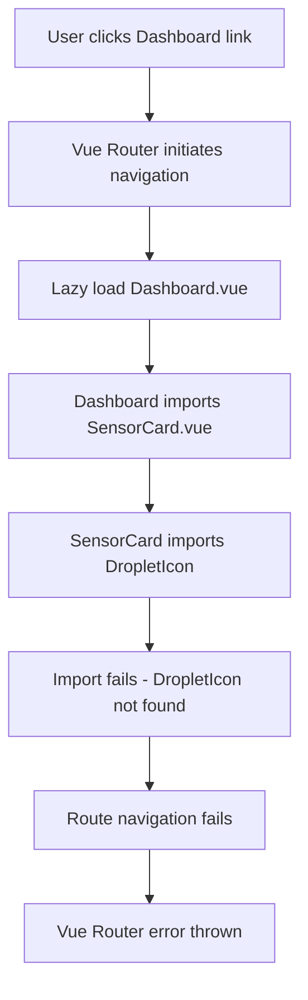
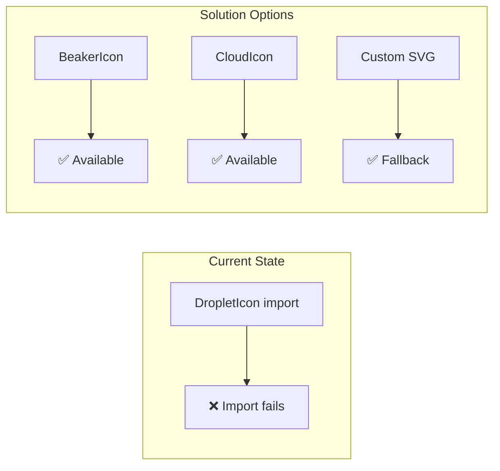
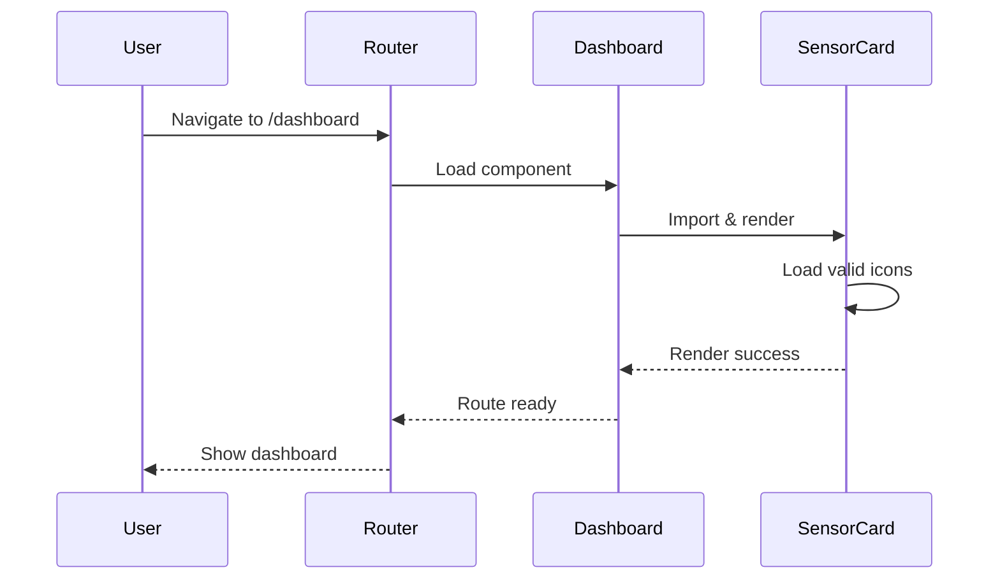
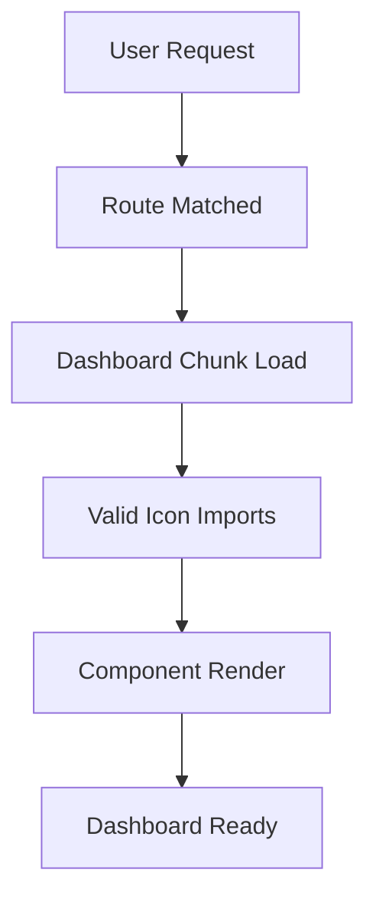

# Vue Router Navigation Debug & Fix Design

## Overview

This design document addresses a critical Vue Router navigation error that prevents users from accessing the Dashboard view. The error occurs during route navigation when the SensorCard component attempts to import a non-existent `DropletIcon` from `@heroicons/vue/24/outline`, causing the entire Dashboard route to fail loading.

## Problem Analysis

### Error Details

- **Error Type**: SyntaxError during route navigation
- **Root Cause**: Missing export `DropletIcon` from `@heroicons/vue/24/outline`
- **Impact**: Complete Dashboard route failure, preventing user access
- **Location**: `SensorCard.vue:106:3`

### Error Chain



### Current Import Structure

```javascript
// In SensorCard.vue (line 106)
import {
  DropletIcon as DropletOutlineIcon, // ❌ This export doesn't exist
} from '@heroicons/vue/24/outline'
```

## Root Cause Analysis

### Icon Availability Investigation

Based on `@heroicons/vue` version `^2.2.0`, the available water-related icons are:

- `BeakerIcon` (available in both outline/solid)
- No direct `DropletIcon` in outline variant
- Alternative icons: `CloudIcon`, `WaterDropIcon` (if available)

### Component Dependencies

```mermaid
graph LR
    Router[Vue Router] --> Dashboard[Dashboard.vue]
    Dashboard --> SensorCard[SensorCard.vue]
    SensorCard --> Heroicons[@heroicons/vue]
    Heroicons -.-> Error[Missing Export Error]
```

## Solution Architecture

### Immediate Fix Strategy

1. **Icon Replacement**: Replace non-existent `DropletIcon` with available alternatives
2. **Import Validation**: Verify all Heroicons imports are valid
3. **Fallback Implementation**: Add error boundaries for missing icons

### Icon Mapping Solution



## Implementation Design

### 1. Icon Import Fix

#### Replace Invalid Import

```javascript
// Remove this line from SensorCard.vue
import { DropletIcon as DropletOutlineIcon } from '@heroicons/vue/24/outline'

// Replace with valid alternative
import { BeakerIcon as DropletOutlineIcon } from '@heroicons/vue/24/outline'
```

#### Sensor Configuration Update

```javascript
const sensorConfig = {
  salinity: {
    title: 'Salinity',
    unit: ' ppt',
    icon: BeakerIcon, // Use available icon instead
    decimals: 0,
  },
}
```

### 2. Icon Validation System

#### Import Verification Pattern

```javascript
// Add validation for icon imports
const validateIconImports = () => {
  const requiredIcons = [
    'BeakerIcon',
    'CloudIcon',
    'ChevronUpIcon',
    'ChevronDownIcon',
    'MinusIcon',
    'FireIcon',
  ]

  // Runtime validation in development
  if (process.env.NODE_ENV === 'development') {
    requiredIcons.forEach((iconName) => {
      if (!window[iconName]) {
        console.warn(`Icon ${iconName} may not be properly imported`)
      }
    })
  }
}
```

### 3. Robust Error Handling

#### Component Error Boundary

```javascript
// Add error handling in SensorCard component
const iconComponent = computed(() => {
  try {
    return config.value.icon || BeakerIcon // Fallback icon
  } catch (error) {
    console.warn('Icon load failed, using fallback:', error)
    return BeakerIcon
  }
})
```

## Testing Strategy

### 1. Navigation Testing



### 2. Icon Load Verification

- Test all sensor types render correctly
- Verify icon fallbacks work
- Validate no console errors during navigation

### 3. Route Validation

- Confirm Dashboard route loads without errors
- Test navigation from all entry points
- Verify lazy loading still functions

## Deployment Considerations

### Development Environment

- Clear Vite dev cache: `rm -rf node_modules/.vite`
- Restart dev server after icon fixes
- Verify HMR works correctly

### Production Build

- Test production build after fixes
- Verify code splitting still works
- Check bundle size impact

## Performance Impact

### Bundle Analysis

- Icon imports have minimal size impact
- Route lazy loading preserved
- No performance degradation expected

### Loading Optimization



## Implementation Steps

### Phase 1: Immediate Fix

1. Identify all invalid Heroicons imports
2. Replace with available alternatives
3. Test Dashboard navigation
4. Verify all sensor cards render

### Phase 2: Enhancement

1. Add icon validation system
2. Implement fallback mechanisms
3. Add development warnings
4. Document icon usage patterns

### Phase 3: Validation

1. Comprehensive navigation testing
2. Cross-browser compatibility check
3. Performance regression testing
4. User acceptance validation

## Monitoring & Maintenance

### Error Tracking

- Monitor for new icon import errors
- Track Dashboard navigation success rate
- Alert on component render failures

### Future Considerations

- Heroicons version updates
- Custom icon system implementation
- Component error boundary patterns
- Performance monitoring integration

## Success Metrics

### Technical Metrics

- Zero navigation errors to Dashboard
- 100% sensor card render success
- Maintained lazy loading performance
- Clean console logs

### User Experience Metrics

- Successful Dashboard access
- All sensor data visible
- Smooth navigation transitions
- No broken UI elements
