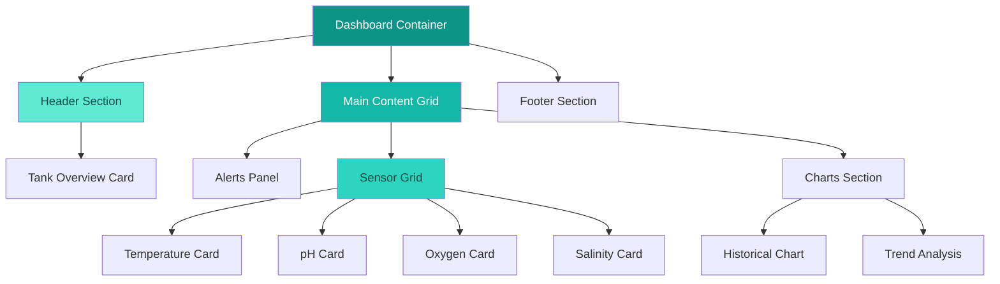

# SmartFish Dashboard - Water Theme Layout Design

## Overview

This design document outlines a modern, sleek layout redesign for the SmartFish aquaculture monitoring dashboard with a water-themed teal color palette. The design focuses on creating a cohesive, intuitive interface that reflects the aquatic nature of the application while maintaining excellent usability and accessibility.

## Design Philosophy

### Water-Inspired Aesthetic

- **Fluid Design**: Smooth, organic shapes that mimic water flow
- **Depth Perception**: Layered components with subtle shadows creating depth like underwater environments
- **Tranquil Color Harmony**: Calming teal palette representing clean, healthy water
- **Natural Patterns**: Gentle gradients and transitions inspired by ocean depths

### Modern Layout Principles

- **Progressive Disclosure**: Information hierarchy that reveals details on demand
- **Responsive Flow**: Adaptive layout that works seamlessly across devices
- **Visual Breathing**: Generous whitespace creating calm, uncluttered interface
- **Consistent Rhythm**: Harmonious spacing and proportions throughout

## Color Palette - Teal Water Theme

### Primary Teal Spectrum

```
Primary Teal: #0d9488 (teal-600)
Light Teal: #5eead4 (teal-300)
Dark Teal: #0f766e (teal-700)
Accent Teal: #2dd4bf (teal-400)
Deep Teal: #134e4a (teal-800)
```

### Supporting Colors

```
Ocean Blue: #0ea5e9 (sky-500)
Seafoam: #6ee7b7 (emerald-300)
Coral Warning: #fb7185 (rose-400)
Sunset Critical: #f87171 (red-400)
Pearl White: #f8fafc (slate-50)
```

### Semantic Color Mapping

- **Normal/Healthy**: Teal-500 (#14b8a6)
- **Warning**: Amber-500 (#f59e0b)
- **Critical**: Rose-500 (#f43f5e)
- **Success**: Emerald-500 (#10b981)
- **Info**: Sky-500 (#0ea5e9)
- **Background**: Slate-50 (#f8fafc)
- **Surface**: White with teal-50 accent

## Layout Architecture

### Grid System

```
Container: max-width-7xl (1280px)
Columns: 12-column grid system
Gutters: 24px (gap-6)
Breakpoints:
  - Mobile: 320px+
  - Tablet: 768px+
  - Desktop: 1024px+
  - Large: 1280px+
```

### Component Hierarchy



## Component Design Specifications

### 1. Tank Overview Header

```
Layout: Full-width hero section
Height: 200px (mobile), 240px (desktop)
Background: Gradient from teal-600 to teal-700
Border Radius: 16px
Shadow: Large with teal tint
```

**Visual Elements:**

- Tank status indicator with animated water ripple effect
- Location badge with seafoam accent
- Action buttons with glass morphism effect
- Connection status with pulsing animation

### 2. Alerts Panel

```
Layout: Sticky sidebar (desktop) / Top banner (mobile)
Width: 320px (desktop) / Full width (mobile)
Background: White with teal-50 accent border
Border: 2px solid teal-200
```

**Alert Types:**

- Critical: Rose-500 background with wave pattern
- Warning: Amber-400 background with ripple effect
- Info: Sky-400 background with gentle gradient

### 3. Sensor Cards Grid

```
Layout: Responsive grid
Columns: 1 (mobile), 2 (tablet), 4 (desktop)
Gap: 24px
Card Dimensions: 280px × 160px
```

**Card Design:**

- Background: White with subtle teal gradient overlay
- Border: 1px solid teal-100
- Border Radius: 12px
- Shadow: Medium with teal-100 tint
- Hover: Lift effect with increased teal shadow

### 4. Historical Charts Section

```
Layout: Full-width below sensor grid
Height: 400px minimum
Background: White with teal-25 background pattern
Border Radius: 16px
```

**Chart Styling:**

- Line colors: Teal spectrum gradient
- Grid lines: Teal-100 with 0.3 opacity
- Tooltips: Teal-600 background with white text
- Axis labels: Slate-600 for readability

## Responsive Layout Patterns

### Mobile (320px - 767px)

```
Stack Order:
1. Tank Overview (full width)
2. Alerts Banner (if any)
3. Sensor Cards (1 column)
4. Charts (full width, reduced height)
```

### Tablet (768px - 1023px)

```
Layout:
- Tank Overview: Full width
- Alerts: Top banner style
- Sensors: 2×2 grid
- Charts: Full width
```

### Desktop (1024px+)

```
Layout:
- Tank Overview: Full width header
- Alerts: Right sidebar (fixed position)
- Sensors: 1×4 horizontal grid
- Charts: 2/3 width, additional widgets 1/3
```

## Animation & Interaction Design

### Micro-Interactions

- **Card Hover**: Subtle lift with teal shadow expansion
- **Button Press**: Ripple effect in teal-400
- **Data Updates**: Gentle pulse animation in sensor values
- **Alert Appearance**: Slide-in from left with bounce

### Loading States

- **Skeleton Screens**: Teal-100 shimmer effect
- **Progress Indicators**: Teal gradient circular progress
- **Data Refresh**: Rotating water droplet icon

### Transitions

- **Page Load**: Staggered component fade-in
- **Route Changes**: Smooth slide transitions
- **Modal Open**: Backdrop blur with modal slide-up
- **Data Updates**: Smooth value interpolation

## Accessibility Features

### Color Contrast

- All text maintains WCAG AA contrast ratios
- Teal primary (#0d9488) provides 4.5:1 contrast on white
- Alternative indicators beyond color for status

### Focus Management

- Visible focus rings in teal-500
- Logical tab order through interactive elements
- Skip links for keyboard navigation

### Screen Reader Support

- Descriptive ARIA labels for all components
- Live regions for dynamic content updates
- Semantic HTML structure with proper headings

## Implementation Guidelines

### CSS Custom Properties

```css
:root {
  /* Water Theme Palette */
  --water-primary: #0d9488;
  --water-light: #5eead4;
  --water-dark: #0f766e;
  --water-accent: #2dd4bf;
  --water-deep: #134e4a;

  /* Surface Colors */
  --surface-primary: #ffffff;
  --surface-secondary: #f8fafc;
  --surface-accent: #f0fdfa;

  /* Semantic Colors */
  --status-normal: #14b8a6;
  --status-warning: #f59e0b;
  --status-critical: #f43f5e;
  --status-success: #10b981;

  /* Animation Timings */
  --transition-fast: 150ms ease-out;
  --transition-normal: 300ms ease-out;
  --transition-slow: 500ms ease-out;

  /* Shadows */
  --shadow-water-sm: 0 2px 8px rgba(13, 148, 136, 0.15);
  --shadow-water-md: 0 4px 16px rgba(13, 148, 136, 0.2);
  --shadow-water-lg: 0 8px 32px rgba(13, 148, 136, 0.25);
}
```

### Tailwind Configuration Extension

```javascript
module.exports = {
  theme: {
    extend: {
      colors: {
        water: {
          50: '#f0fdfa',
          100: '#ccfbf1',
          200: '#99f6e4',
          300: '#5eead4',
          400: '#2dd4bf',
          500: '#14b8a6',
          600: '#0d9488',
          700: '#0f766e',
          800: '#115e59',
          900: '#134e4a',
        },
      },
      animation: {
        ripple: 'ripple 2s ease-out infinite',
        float: 'float 3s ease-in-out infinite',
        wave: 'wave 4s ease-in-out infinite',
      },
      boxShadow: {
        'water-sm': '0 2px 8px rgba(13, 148, 136, 0.15)',
        'water-md': '0 4px 16px rgba(13, 148, 136, 0.2)',
        'water-lg': '0 8px 32px rgba(13, 148, 136, 0.25)',
      },
    },
  },
}
```

## Component-Specific Styling

### Tank Overview Component

```css
.tank-overview {
  @apply bg-gradient-to-br from-water-600 to-water-700;
  @apply rounded-2xl shadow-water-lg;
  @apply text-white p-6;
  position: relative;
  overflow: hidden;
}

.tank-overview::before {
  content: '';
  position: absolute;
  top: 0;
  left: 0;
  right: 0;
  bottom: 0;
  background: url('data:image/svg+xml,<svg xmlns="http://www.w3.org/2000/svg" viewBox="0 0 100 100"><path d="M0,50 Q25,30 50,50 T100,50 L100,100 L0,100 Z" fill="rgba(255,255,255,0.1)"/></svg>');
  background-size: 200px 100px;
  animation: wave 8s ease-in-out infinite;
}

.status-indicator {
  @apply flex items-center space-x-2;
}

.status-dot {
  @apply w-3 h-3 rounded-full;
  animation: pulse 2s ease-in-out infinite;
}

.status-dot--healthy {
  @apply bg-emerald-400;
}
.status-dot--warning {
  @apply bg-amber-400;
}
.status-dot--critical {
  @apply bg-rose-400;
}
```

### Sensor Card Component

```css
.sensor-card {
  @apply bg-white rounded-xl shadow-water-md;
  @apply border border-water-100 p-4;
  @apply transition-all duration-300;
  position: relative;
}

.sensor-card:hover {
  @apply shadow-water-lg -translate-y-1;
  @apply border-water-200;
}

.sensor-value {
  @apply text-2xl font-bold text-water-700;
  @apply transition-all duration-500;
}

.sensor-trend {
  @apply inline-flex items-center space-x-1;
}

.trend-up {
  @apply text-emerald-500;
}
.trend-down {
  @apply text-rose-500;
}
.trend-stable {
  @apply text-water-500;
}
```

### Alerts Panel Component

```css
.alerts-panel {
  @apply bg-white rounded-xl shadow-water-md;
  @apply border-l-4 border-water-400;
  @apply max-h-96 overflow-y-auto;
}

.alert-item {
  @apply p-3 border-b border-water-50;
  @apply transition-all duration-200;
}

.alert-item:hover {
  @apply bg-water-25;
}

.alert-critical {
  @apply bg-rose-50 border-l-rose-400;
}

.alert-warning {
  @apply bg-amber-50 border-l-amber-400;
}

.alert-info {
  @apply bg-sky-50 border-l-sky-400;
}
```

### Historical Chart Component

```css
.chart-container {
  @apply bg-white rounded-xl shadow-water-md p-6;
  @apply border border-water-100;
}

.chart-header {
  @apply flex items-center justify-between mb-4;
  @apply pb-4 border-b border-water-100;
}

.chart-title {
  @apply text-xl font-semibold text-water-700;
}

.chart-controls {
  @apply flex space-x-2;
}

.time-range-btn {
  @apply px-3 py-1 rounded-lg text-sm;
  @apply transition-all duration-200;
  @apply border border-water-200 text-water-600;
}

.time-range-btn--active {
  @apply bg-water-500 text-white border-water-500;
}
```

## Performance Considerations

### CSS Optimization

- Use CSS custom properties for theme consistency
- Minimize animation complexity on mobile devices
- Leverage GPU acceleration for smooth transitions
- Implement critical CSS for faster initial load

### Image Optimization

- Use SVG icons with teal color theming
- Implement lazy loading for chart images
- Optimize background patterns for file size
- Consider WebP format for photographic elements

### Animation Performance

- Use transform and opacity for smooth animations
- Avoid animating layout properties
- Implement reduced-motion preferences
- Debounce scroll-triggered animations

## Testing Strategy

### Visual Regression Testing

- Capture screenshots across breakpoints
- Test color contrast ratios automatically
- Verify animation smoothness on various devices
- Check component spacing consistency

### Accessibility Testing

- Screen reader navigation flow
- Keyboard-only interaction testing
- Color blindness simulation
- Focus management verification

### Cross-Browser Compatibility

- Test modern gradient support
- Verify CSS custom properties
- Check animation performance
- Validate responsive behavior

This design creates a cohesive, modern interface that reflects the aquatic nature of the SmartFish application while providing excellent usability and visual appeal through the water-themed teal palette.
