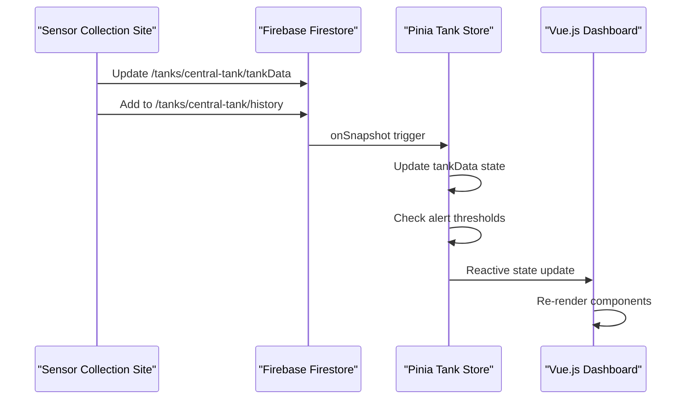

# SmartFish Sensor Data Collection Integration

## Overview

This document describes the integration between the sensor data collection HTML site and the SmartFish Vue.js dashboard application. The sensor collection site has been adapted to write data in the correct format expected by the Vue.js application.

## Files

- `sensor-collection.html` - Adapted sensor data collection interface
- Original Vue.js SmartFish application in `src/` directory

## Key Integration Changes Made

### 1. Document Structure Compliance
- **Before**: Data was written directly to tank document fields
- **After**: Data is wrapped in `tankData` object to match Vue.js expectations

```javascript
// Vue.js expects this structure:
{
  tankData: {
    name: "Tanque central",
    location: "Desconhecida", 
    lastUpdate: "2025-01-14T19:14:08.771Z",
    stage: "Crescimento",
    status: "healthy",
    sensors: {
      ph: 7.1,
      temperature: 26.5,
      oxygen: 8.2,
      salinity: 30
    }
  }
}
```

### 2. Tank ID Standardization
- **Before**: Dynamic tank IDs generated from tank names
- **After**: Fixed `central-tank` ID for compatibility with Vue.js app

### 3. Historical Data Structure
- **Before**: Used `historicalData` subcollection  
- **After**: Uses `history` subcollection to match Vue.js expectations

### 4. Firebase Configuration Alignment
- Updated to use the same Firebase project configuration as Vue.js app
- Maintains same project ID and authentication domain

### 5. Input Validation & Data Quality
- Added proper sensor value range validation
- Rounds values to one decimal place for consistency
- Calculates tank status based on sensor thresholds

## How to Use

### Step 1: Start the Vue.js Dashboard
```bash
cd /path/to/smartfish
npm install
npm run dev
```
The dashboard will be available at `http://localhost:3002/`

### Step 2: Open the Sensor Collection Site
Open `sensor-collection.html` in a web browser.

### Step 3: Enter Sensor Data
1. Enter sensor values in the form:
   - **pH**: 0.0 - 14.0
   - **Temperature**: -10.0 - 50.0 °C  
   - **Oxygen**: 0.0 - 20.0 mg/L
   - **Salinity**: 0.0 - 50.0 ppt

2. Click "Salvar Leitura dos Sensores"

3. Data will be saved to Firestore and appear in real-time on the Vue.js dashboard

### Step 4: Verify Integration
1. Check the Vue.js dashboard at `http://localhost:3002/`
2. Navigate to the Dashboard view
3. Verify that sensor readings appear in real-time
4. Check that historical charts update with new data
5. Confirm alerts are generated for out-of-range values

## Data Flow



## Validation Rules

### Sensor Value Ranges
| Sensor      | Min Value | Max Value | Unit | Precision |
|-------------|-----------|-----------|------|-----------|
| pH          | 0.0       | 14.0      | -    | 1 decimal |
| Temperature | -10.0     | 50.0      | °C   | 1 decimal |
| Oxygen      | 0.0       | 20.0      | mg/L | 1 decimal |
| Salinity    | 0.0       | 50.0      | ppt  | 1 decimal |

### Alert Thresholds
The system automatically calculates tank status based on these thresholds:

- **Temperature**: Normal 20-30°C, Critical >35°C
- **pH**: Normal 6.0-8.0, Critical >9.0  
- **Oxygen**: Normal 5.0-12.0 mg/L, Critical <3.0 mg/L
- **Salinity**: Normal 25-35 ppt, Critical >40 ppt

## Visual Design Features

The sensor collection site features a water-themed design using the SmartFish teal color palette:

- **Primary**: #0d9488 (teal-600)
- **Light**: #5eead4 (teal-300)  
- **Dark**: #0f766e (teal-700)
- **Accent**: #2dd4bf (teal-400)
- **Deep**: #134e4a (teal-900)

Additional features:
- Glass morphism effects with backdrop blur
- Floating animations for aquatic feel
- Real-time connection status indicator
- Responsive design for mobile devices

## Troubleshooting

### Connection Issues
- Check the connection status indicator in the top-right corner
- Verify Firebase configuration matches the Vue.js app
- Ensure internet connectivity for Firebase access

### Data Not Appearing in Dashboard
1. Verify the Vue.js development server is running
2. Check browser console for Firebase errors
3. Confirm tank ID is set to `central-tank`
4. Verify data is wrapped in `tankData` object

### Validation Errors
- Ensure all sensor values are within valid ranges
- Check that values are numeric (not text)
- Verify no fields are left empty

## Development Notes

- The sensor collection site uses Firebase v10.12.2 for compatibility
- Firestore security rules should allow read/write access to `/tanks/central-tank`
- The Vue.js app uses real-time listeners for immediate data updates
- Historical data is stored with server timestamps for accurate ordering

## Future Enhancements

- Add user authentication for secure access
- Implement batch data upload for multiple readings
- Add data export functionality  
- Include sensor calibration features
- Support for multiple tank configurations